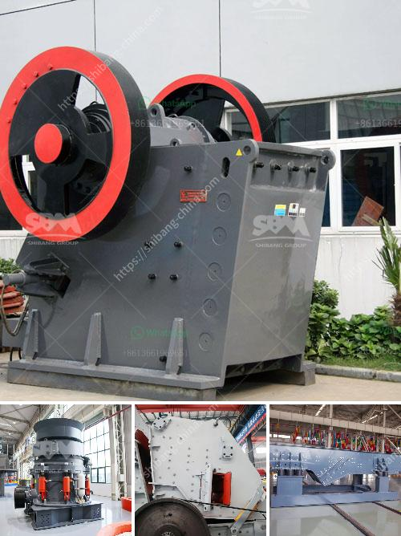

<h3>series de molino ultrafino vertical de rodillos</h3>
Los molinos ultrafinos verticales de rodillos son una innovadora tecnología en la industria de la molienda. Diseñados para producir polvo ultrafino, estos molinos son ampliamente utilizados en la industria del cemento, metalurgia, industria química, industria minera y otras industrias.

El molino ultrafino vertical de rodillos de la serie LUM está diseñado y desarrollado por SBM, un fabricante líder en maquinaria de minería y construcción. Este molino presenta una estructura compacta, un diseño innovador, una operación fácil y un mantenimiento conveniente.

Una de las principales ventajas del molino ultrafino vertical de rodillos es su eficiencia energética. Gracias a su diseño vertical, este molino utiliza de manera más efectiva la energía de alimentación y reduce la pérdida de energía causada por la fricción y la inercia. Además, cuenta con un sistema de recirculación de aire que reduce aún más el consumo de energía.

Otra característica destacada de estos molinos es su capacidad de producir polvo ultrafino. El tamaño de partícula final puede variar entre 325 mallas y 2500 mallas (47-5 micras), lo que lo convierte en el equipo perfecto para la molienda de materiales con alta dureza y baja abrasividad.

Además de su eficiencia y capacidad de producción de polvo ultrafino, estos molinos también destacan por su alta precisión en el control de calidad del producto final. El clasificador de precisión incorporado asegura una distribución uniforme del tamaño de partícula y una calidad constante del producto final.

En resumen, los molinos ultrafinos verticales de rodillos de la serie LUM son una solución perfecta para la producción de polvo ultrafino en diversas industrias. Con su eficiencia energética, capacidad de producción y control de calidad, estos molinos representan la última tecnología en molienda industrial. Si buscas mejorar tus procesos de molienda, definitivamente debes considerar los molinos ultrafinos verticales de rodillos de la serie LUM.
<h3>Contact us</h3><ul><li><strong>Whatsapp:&nbsp;<a href="https://wa.me/8613661969651">+8613661969651</a></strong></li><li><a href="https://swt.shibang-china.com/?git&amp;zhl&amp;series de molino ultrafino vertical de rodillos"><strong>Online Service(chat now)</strong></a></li></ul><h3>Related</h3><ul><li><a href='5mm limestones grinding to powder.md'>5mm limestones grinding to powder</a></li><li><a href='total cost of machinery of stone crusher.md'>total cost of machinery of stone crusher</a></li><li><a href='hydraulic roll crusher zenith.md'>hydraulic roll crusher zenith</a></li><li><a href='germany stone crusher.md'>germany stone crusher</a></li><li><a href='small crusher project.md'>small crusher project</a></li></ul>