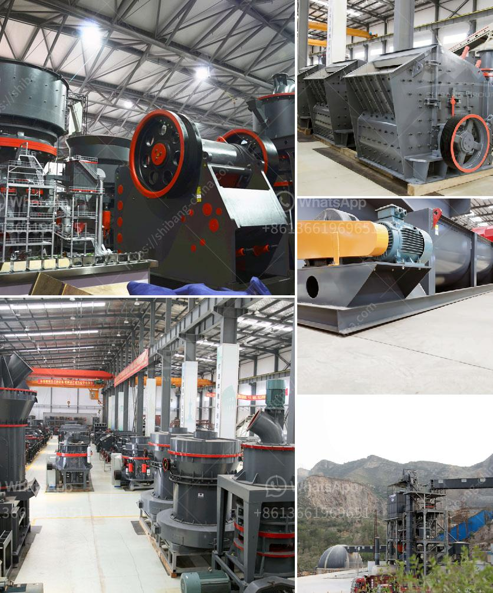

<h3>sewa stone crusher plant</h3>
In recent years, the construction industry has been steadily increasing its focus on sustainability and environmentally friendly practices. However, there are still instances where a temporary stone crushing plant is needed to meet the increasing demand for crushed stones in the construction site. To address this demand, an option that has been gaining traction is the rental of stone crusher plants. Sewa stone crusher plants provide a convenient solution to meet the construction needs of temporary projects.

Stone crusher plants have been utilized for long periods in the construction industry. However, they are not suitable for projects that require continuous usage over a prolonged period. In such cases, the rental of stone crusher plants is a popular option for short-term projects.

The stone crusher plant rental service offered by Sewa Rental Stone Crusher is beneficial for those construction projects where you need to crush stones on-site temporarily. The service is available with a qualified and efficient workforce who perform their duties sincerely and responsibly to provide the best outcome for the project.

One of the main advantages of renting a stone crusher plant is the flexibility and freedom it offers. When you rent a plant, you get access to a wide range of machines with different specifications. This allows you to choose the most suitable equipment for your project without having to invest in it permanently. Additionally, rental services typically include maintenance and technical support, ensuring that the equipment operates efficiently during the entire rental period.

Moreover, renting a stone crusher plant eliminates the need for extensive storage space and additional transportation costs. Once the project is completed, the equipment is simply returned, reducing the logistical burden associated with purchasing and maintaining your own stone crusher plant.

In conclusion, the rental of stone crusher plants is a cost-effective and convenient way of catering to the construction needs of temporary projects. With the development of environmentally friendly practices, the demand for crushed stones is expected to increase further. Therefore, opting for Sewa stone crusher plants can be a practical solution for contractors and construction companies looking to meet this growing demand in a sustainable manner.
<h3>Contact us</h3><ul><li><strong>Whatsapp:&nbsp;<a href="https://wa.me/8613661969651">+8613661969651</a></strong></li><li><a href="https://swt.shibang-china.com/?git&amp;zhl&amp;sewa stone crusher plant"><strong>Online Service(chat now)</strong></a></li></ul><h3>Related</h3><ul><li><a href='cara mengelola debu crucher batu bara.md'>cara mengelola debu crucher batu bara</a></li><li><a href='types of crusher for ore processing.md'>types of crusher for ore processing</a></li><li><a href='vertical grinder mill.md'>vertical grinder mill</a></li><li><a href='barite bulking process.md'>barite bulking process</a></li><li><a href='ballast crushers cost.md'>ballast crushers cost</a></li></ul>