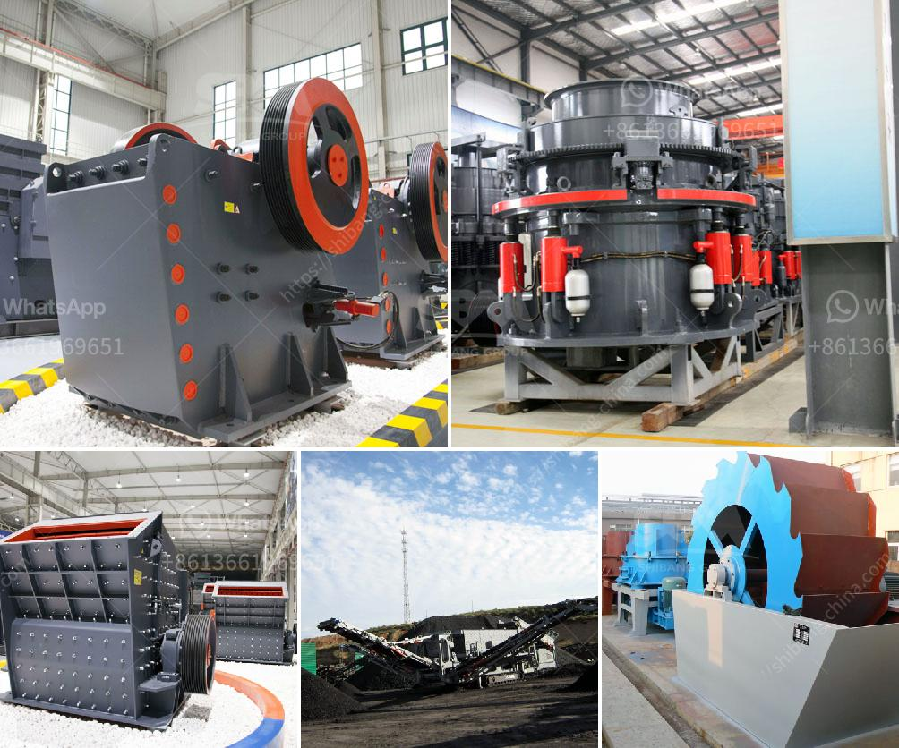

<h3>silica sand crusher rajasthan</h3>
Silica sand is one of the most important industrial minerals used in various industries such as construction, ceramics, glass, and foundry. Rajasthan, known for its vast reserves of various minerals, including silica sand, has emerged as a prominent destination for mining and processing of this valuable resource.

The state of Rajasthan is home to abundant silica sand deposits, which are mainly found in the districts of Jaisalmer, Barmer, Bikaner, Jodhpur, and Udaipur. These deposits contain high-quality silica sand with a high silica content and low impurities, making it ideal for industrial use.

To cater to the growing demand for silica sand, several crushing units have been established in Rajasthan. Among them, the silica sand crusher plays a crucial role in the crushing process of silica sand. It is responsible for reducing the size of the silica sand to the required size for various applications.

The silica sand crusher comprises a primary jaw crusher and a secondary cone crusher. The material is first reduced in size by the primary jaw crusher, and then further crushed by the secondary cone crusher. The crushed silica sand particles are then screened to separate the desired size fractions for different applications.

The silica sand crusher in Rajasthan is equipped with advanced technology and high-quality components, ensuring efficient and reliable performance. It has a robust construction, making it durable and long-lasting. The crusher is designed to handle a wide range of feed materials, from soft to hard, abrasive, and even sticky ones.

Apart from crushing silica sand, the crusher in Rajasthan can also be used to crush other minerals and rocks. It offers versatility for various applications and is widely used in mining, metallurgy, construction, highway, railway, water conservancy, and chemical industries.

In conclusion, the silica sand crusher in Rajasthan plays a crucial role in the processing of silica sand to meet the growing demands of various industries. With its advanced technology, durable construction, and versatile applications, the crusher is a reliable and efficient solution for crushing silica sand and other minerals.
<h3>Contact us</h3><ul><li><strong>Whatsapp:&nbsp;<a href="https://wa.me/8613661969651">+8613661969651</a></strong></li><li><a href="https://swt.shibang-china.com/?git&amp;zhl&amp;silica sand crusher rajasthan"><strong>Online Service(chat now)</strong></a></li></ul><h3>Related</h3><ul><li><a href='mill grinder for sale.md'>mill grinder for sale</a></li><li><a href='stone crushing plants in kenya.md'>stone crushing plants in kenya</a></li><li><a href='grinding plant improvement.md'>grinding plant improvement</a></li><li><a href='stone grinding plant.md'>stone grinding plant</a></li><li><a href='belt conveyor calculation sheet.md'>belt conveyor calculation sheet</a></li></ul>