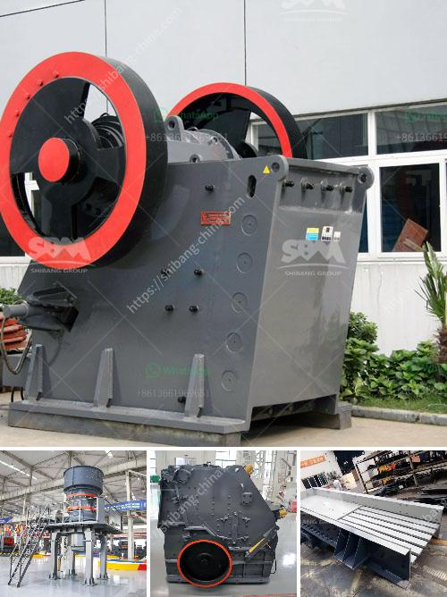

<h3>silica sand crusher suppliers toronto</h3>
Silica sand is a highly versatile product that has many uses in various industries. It is a crucial material for manufacturing glass, ceramics, and concrete, and it is also used in the production of molds and castings in foundries. As the demand for silica sand continues to grow, the need for efficient crushing equipment becomes increasingly important.

Toronto, being a vibrant and technology-driven city, is home to several silica sand crusher suppliers. These suppliers offer a wide range of crushers and other equipment that help in the efficient processing of silica sand. They provide both primary and secondary crushers, along with screening and washing equipment to ensure the quality and purity of the final product.

One of the key advantages of working with a silica sand crusher supplier in Toronto is the access to cutting-edge technology. These suppliers continually invest in research and development to improve their equipment's performance, efficiency, and durability. By utilizing advanced crushing techniques, such as impact and cone crushers, they can produce silica sand with consistent particle size and shape, resulting in a superior end product.

Moreover, these suppliers understand the unique needs of the various industries that utilize silica sand. Whether it's for glass manufacturing or foundry applications, they can provide customized solutions that meet the specific requirements of their clients. Additionally, they offer comprehensive after-sales support, including maintenance, spare parts, and technical assistance, to ensure smooth operations and maximum productivity.

When selecting a silica sand crusher supplier in Toronto, it is essential to consider their reputation, experience, and customer reviews. Reliable suppliers will have a proven track record of delivering high-quality equipment and excellent customer service. They will also have a wide range of options available to suit different budget and production requirements.

In conclusion, silica sand crusher suppliers in Toronto play a crucial role in supporting various industries that rely on this versatile material. With their advanced equipment and expertise, they can provide efficient and customized solutions for crushing, screening, and washing silica sand, ensuring the production of high-quality products.
<h3>Contact us</h3><ul><li><strong>Whatsapp:&nbsp;<a href="https://wa.me/8613661969651">+8613661969651</a></strong></li><li><a href="https://swt.shibang-china.com/?git&amp;zhl&amp;silica sand crusher suppliers toronto"><strong>Online Service(chat now)</strong></a></li></ul><h3>Related</h3><ul><li><a href='coal screening process.md'>coal screening process</a></li><li><a href='manufacturer of cement packing plant machine.md'>manufacturer of cement packing plant machine</a></li><li><a href='second hand jaw crusher for sale in malaysia.md'>second hand jaw crusher for sale in malaysia</a></li><li><a href='china pasir harga washing plant.md'>china pasir harga washing plant</a></li><li><a href='cement clinker plant.md'>cement clinker plant</a></li></ul>