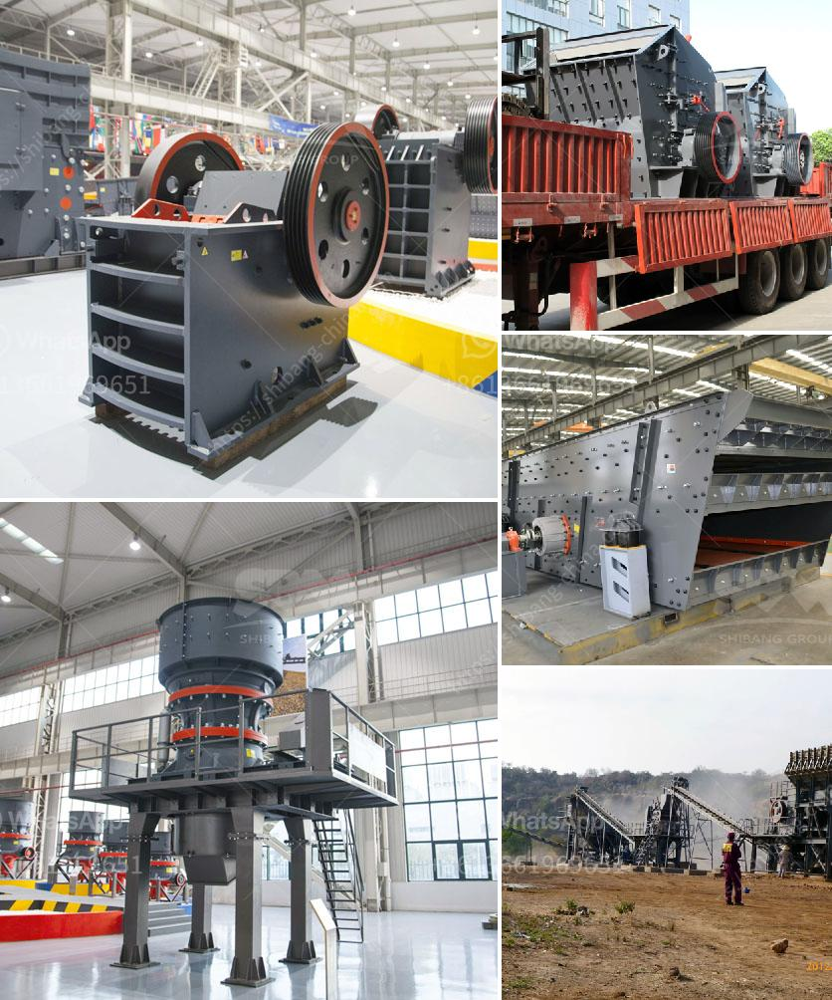

<h3>silica sand mine owners in pakistan</h3>
Pakistan is blessed with an abundant supply of natural resources that play a crucial role in its economic growth and development. Among these resources, silica sand stands out as one of the most valuable minerals, particularly in the construction and glass manufacturing industries. Silica sand mine owners in Pakistan play a significant role in harnessing this resource and meeting the growing demand both domestically and internationally.

Silica sand is composed of quartz grains that are highly pure, making it an ideal material for various industrial applications. Pakistan's silica sand deposits are primarily found in the Sindh and Punjab provinces, with the Tharparkar district being a major producer. Many regions across the country have massive reserves of silica sand, enabling Pakistan to become a significant player in the global market.

Silica sand mine owners in Pakistan are responsible for the extraction, processing, and transportation of this essential mineral. They invest in modern mining equipment and techniques to extract silica sand from the earth, ensuring high-quality products. These mine owners also comply with strict safety and environmental regulations to minimize the impact on the surrounding ecosystem.

The construction industry is the largest consumer of silica sand in Pakistan. It is a vital component in the production of construction materials such as concrete and asphalt. Silica sand improves the durability and strength of these materials, making them suitable for a wide range of applications, including infrastructure projects, residential buildings, and commercial structures. The high demand for construction materials in Pakistan's growing urban areas, along with government investment in infrastructure, has contributed to the increased demand for silica sand.

Moreover, silica sand mine owners in Pakistan have also tapped into the international market. Many countries are importing silica sand from Pakistan due to its superior quality and cost-effectiveness. The silica sand from Pakistan is exported to various countries worldwide, including the United Arab Emirates, Qatar, Saudi Arabia, and others. The consistent supply of high-quality silica sand has made Pakistan a reliable source for meeting the global demand.

The glass manufacturing industry is another major consumer of silica sand. Silica sand mine owners in Pakistan supply the glass industry with the essential raw material required for producing various glass products, including bottles, containers, windows, and fiberglass. The high purity and consistency of the silica sand from Pakistan make it an ideal resource for glass manufacturing, ensuring transparency, strength, and other desired properties.

Recognizing the importance of silica sand, the Pakistani government has taken steps to support and regulate the industry. The government encourages investment in silica sand mining operations, offers incentives, and ensures favorable policies for local and international stakeholders. This support has boosted the confidence of silica sand mine owners in expanding their operations and exploring further untapped reserves.

In conclusion, silica sand mine owners in Pakistan play a vital role in harnessing the country's abundant natural resources. With a significant presence in both the domestic and international markets, these mine owners ensure a consistent supply of high-quality silica sand for the construction and glass manufacturing industries. Their contribution to Pakistan's economy and the global demand for silica sand is undeniable, making them key players in the country's resource development sector.
<h3>Contact us</h3><ul><li><strong>Whatsapp:&nbsp;<a href="https://wa.me/8613661969651">+8613661969651</a></strong></li><li><a href="https://swt.shibang-china.com/?git&amp;zhl&amp;silica sand mine owners in pakistan"><strong>Online Service(chat now)</strong></a></li></ul><h3>Related</h3><ul><li><a href='130 150 jaw crusher.md'>130 150 jaw crusher</a></li><li><a href='mineral beneficiation screening ppt.md'>mineral beneficiation screening ppt</a></li><li><a href='sand making crusher.md'>sand making crusher</a></li><li><a href='ball mill in peru.md'>ball mill in peru</a></li><li><a href='stone crusher sale.md'>stone crusher sale</a></li></ul>