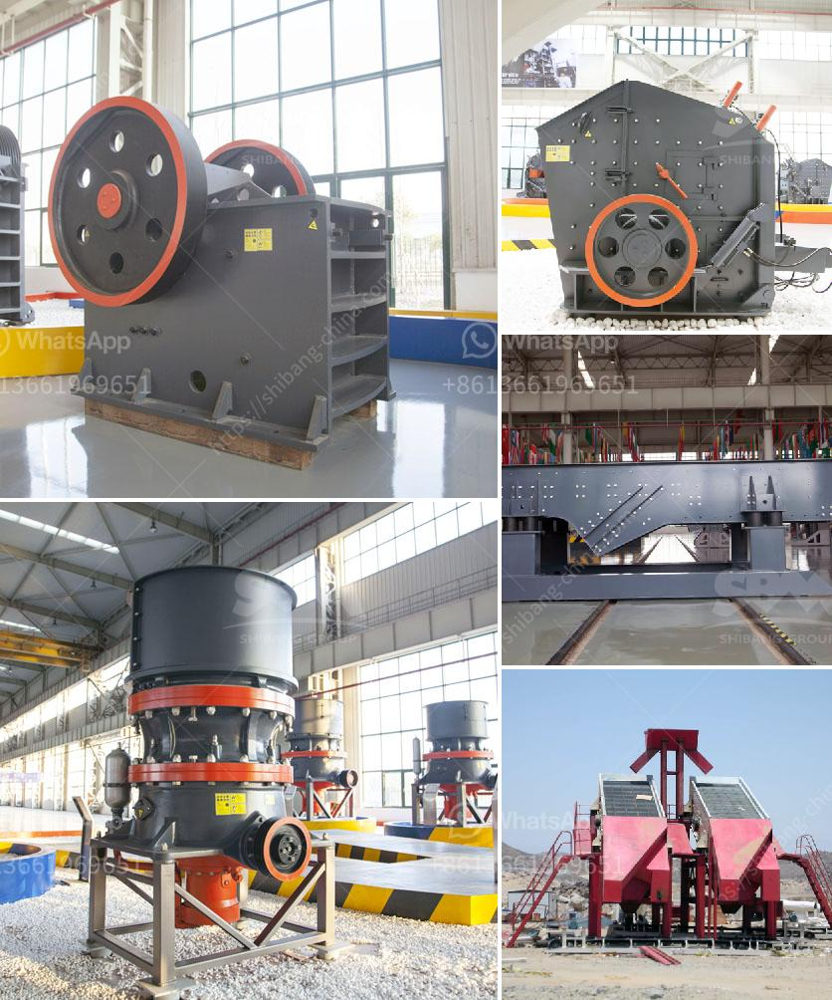

<h3>silica sand plant construction</h3>
Silica sand, also known as quartz sand, is a commonly used material in many industrial processes and construction projects. It is a key ingredient in the production of glass, ceramics, and a wide range of other products. Due to its numerous applications, the demand for silica sand has been steadily increasing, prompting the need for silica sand plant construction to meet the growing demand.

Building a silica sand plant involves several crucial steps. The first step is site selection, where factors such as access to transportation, proximity to the source of silica sand, and availability of utilities are considered. This ensures that the plant is located in an optimal location for efficient operations.

The next step is the design and engineering of the plant. This entails the creation of a comprehensive plan that includes the layout of the plant, the selection of equipment, and the establishment of safety protocols. The design should take into account the specific requirements of the silica sand production process and ensure that all necessary processes are in place to achieve high-quality output.

Once the design is finalized, the construction phase begins. This involves erecting the necessary infrastructure, such as buildings, storage facilities, and processing units. Special attention is given to the construction of the processing units, where the silica sand is washed, dried, and sorted according to its size and quality.

During the construction phase, environmental considerations are also taken into account. Measures are put in place to minimize dust emissions, control noise levels, and prevent the release of harmful substances into the surrounding environment. This ensures that the silica sand plant operates in compliance with environmental regulations and safeguards the health and well-being of both workers and nearby communities.

After the construction is completed, the silica sand plant undergoes testing and commissioning to ensure that all systems are functioning properly. This involves a series of rigorous tests to verify the quality of the silica sand produced and to make any necessary adjustments to ensure optimum performance.

In conclusion, the construction of a silica sand plant is a complex process that requires careful planning, design, and execution. It is essential for meeting the increasing demand for silica sand in various industries. By following the necessary steps and adhering to environmental regulations, a well-constructed silica sand plant can contribute to the efficient production of high-quality silica sand, driving economic growth and meeting the needs of various industrial sectors.
<h3>Contact us</h3><ul><li><strong>Whatsapp:&nbsp;<a href="https://wa.me/8613661969651">+8613661969651</a></strong></li><li><a href="https://swt.shibang-china.com/?git&amp;zhl&amp;silica sand plant construction"><strong>Online Service(chat now)</strong></a></li></ul><h3>Related</h3><ul><li><a href='mobile stone crusher in germany.md'>mobile stone crusher in germany</a></li><li><a href='jaw crusher small size product.md'>jaw crusher small size product</a></li><li><a href='top mobile crusher.md'>top mobile crusher</a></li><li><a href='crusher unit manufacturer india.md'>crusher unit manufacturer india</a></li><li><a href='ball mill manufacturers in korea.md'>ball mill manufacturers in korea</a></li></ul>