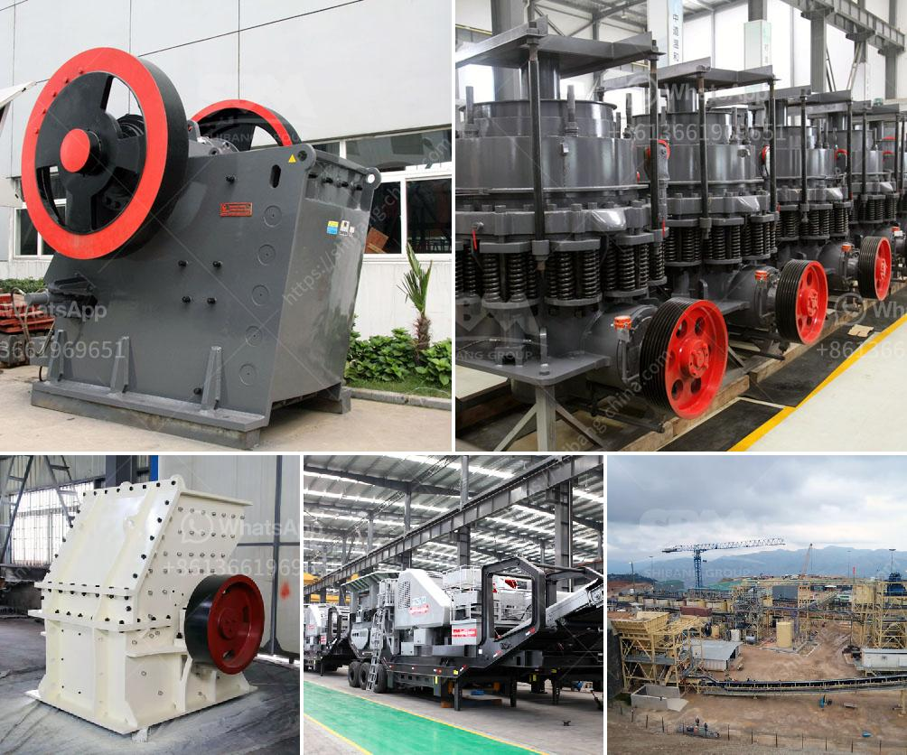

<h3>silica sand processing plant flowchart</h3>
Silica sand, also known as quartz sand or industrial sand, is one of the most common types of sand found in the world. It is used for a wide range of applications, including glass making, foundry sand, ceramics, construction materials, fillers, and abrasives. With such diverse uses, silica sand processing plants are becoming more and more important to meet the growing demand.

A silica sand processing plant flowchart is made up of several distinct steps, including crushing, screening, desliming, washing, and drying. The potential silica sand deposits are first excavated from the earth and then transported to the processing plant site for further classification and beneficiation.

In the first step, the excavated silica sand is broken into smaller pieces using a variety of crushing equipment. Common crushing techniques include jaw crushers, cone crushers, and impact crushers. The purpose of crushing is to reduce the silica sand to a size suitable for further processing and to remove impurities such as clay or iron oxides.

After crushing, the silica sand is then screened to separate it into various size fractions. This process ensures that only the desired size of silica sand is further processed, while larger or smaller particles are removed. Vibrating screens or trommel screens are commonly used for this purpose.

Desliming is a process used to remove fine particles, such as clay or silt, from the silica sand. This is important because fine particles can interfere with the quality and performance of the final product. Desliming can be achieved using hydrocyclones or classifiers, which separate the fine particles from the silica sand.

Following desliming, the silica sand is washed to remove any remaining impurities, such as dirt or organic matter. This is typically done using water and can involve various methods, including scrubbing, attrition, or flotation. The goal of washing is to produce a clean, high-quality silica sand product suitable for the intended application.

The final step in the silica sand processing plant flowchart is drying. After the washing process, the washed silica sand is mechanically or thermally dried to reduce the moisture content and improve handling and storage. Drying methods include rotary dryers, fluidized bed dryers, or belt dryers, depending on the specific requirements of the processing plant.

In conclusion, a silica sand processing plant flowchart plays a crucial role in the production of high-quality silica sand. Each step in the flowchart is designed to remove impurities and create a clean, consistent product that meets industry standards. By following the flowchart, silica sand producers can optimize their processing operations and ensure the production of high-quality silica sand for various applications.
<h3>Contact us</h3><ul><li><strong>Whatsapp:&nbsp;<a href="https://wa.me/8613661969651">+8613661969651</a></strong></li><li><a href="https://swt.shibang-china.com/?git&amp;zhl&amp;silica sand processing plant flowchart"><strong>Online Service(chat now)</strong></a></li></ul><h3>Related</h3><ul><li><a href='grinding mill machine roller mill size.md'>grinding mill machine roller mill size</a></li><li><a href='price of cone crusher.md'>price of cone crusher</a></li><li><a href='roll mill manufacturere in mumbai.md'>roll mill manufacturere in mumbai</a></li><li><a href='how much is a crusher mincer in malaysia.md'>how much is a crusher mincer in malaysia</a></li><li><a href='stone crusher process.md'>stone crusher process</a></li></ul>