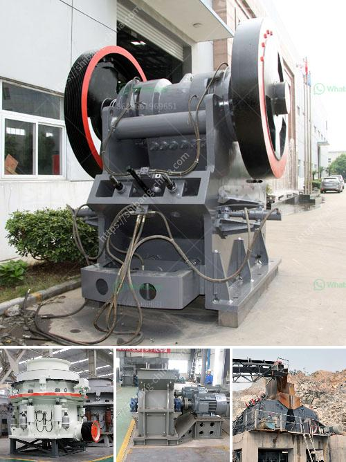

<h3>silica sand washing steps</h3>
Silica sand is a versatile and widely used material in various industries, such as construction, glass manufacturing, and water filtration. However, before it can be used in these applications, it needs to be processed through a series of washing steps to remove impurities and enhance its quality. Here, we will discuss the essential steps involved in silica sand washing.

The first step in the silica sand washing process is feeding the raw sand into a receiving bin, where it is then transferred to a vibrating screen for size classification. This step is crucial as it helps remove any oversized particles or debris that may be present.

Once the sand is classified, it is sent to a scrubber, where high-pressure water is used to remove surface contaminants, such as clay and silt. This process aids in reducing the overall impurities present in the sand.

Following the scrubbing process, the sand is subjected to a dewatering screen, where excess water is removed. This step is essential as it helps control the moisture content of the sand, making it suitable for further processing.

The next step is the washing process, where the sand is further cleaned using chemicals or detergents. This step helps remove stubborn stains or impurities that may still be present after scrubbing.

After washing, the sand is dewatered again to remove excess water and achieve the desired moisture content. This step is crucial in ensuring the final product meets the specific requirements of the intended application.

Finally, the washed and dewatered sand is transported to a drying facility, where it is subjected to controlled heat for evaporation of any remaining moisture. This step is essential to ensure the sand is adequately dried and ready for use.

In conclusion, the washing steps involved in silica sand processing are vital for obtaining high-quality sand that is free from impurities. From classification and scrubbing to washing, dewatering, and drying, each step plays a significant role in producing silica sand suitable for various industries. By following these steps, producers can ensure a consistent and reliable supply of silica sand for their specific applications.
<h3>Contact us</h3><ul><li><strong>Whatsapp:&nbsp;<a href="https://wa.me/8613661969651">+8613661969651</a></strong></li><li><a href="https://swt.shibang-china.com/?git&amp;zhl&amp;silica sand washing steps"><strong>Online Service(chat now)</strong></a></li></ul><h3>Related</h3><ul><li><a href='ball mill 3 ton.md'>ball mill 3 ton</a></li><li><a href='prototype of a crushing machine.md'>prototype of a crushing machine</a></li><li><a href='cedar rapids crusher for sale.md'>cedar rapids crusher for sale</a></li><li><a href='stone quarrying machines in dubai.md'>stone quarrying machines in dubai</a></li><li><a href='tata stone crusher machines nairobi.md'>tata stone crusher machines nairobi</a></li></ul>