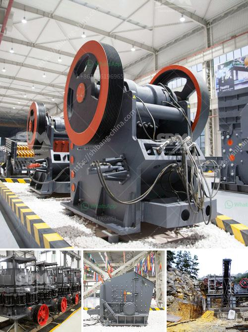

<h3>silica washing plant</h3>
Silica washing plants are capable of cleaning and purifying a wide range of silica sand particles, removing impurities such as slimes and clay and classifying the sand according to various particle sizes. These plants are essential in producing premium-quality silica sand for the glass and foundry industry.

Silica, also known as silicon dioxide, is one of the most abundant minerals on earth and is a major component in many industrial products. Silica sand is commonly used in construction, water filtration, and glass manufacturing due to its high purity and desirable physical properties. However, raw silica sand is often contaminated with impurities that need to be removed for it to be suitable for these applications.

The primary objective of a silica washing plant is to generate silica sand that meets the specifications and requirements set by various industries. To achieve this, the plant utilizes a series of washing and classification processes. The silica sand is first fed into a hopper, where it is transported by a conveyor belt to a vibrating screen. The vibrating screen separates the silica sand into different sizes of particles, effectively classifying it.

Once the sand is classified, it is then fed into a hydrocyclone. The hydrocyclone, also known as a sand separator, uses centrifugal force to separate impurities from the silica sand. The hydrocyclone consists of a conical-shaped chamber with a tangential inlet for the slurry flow. As the slurry enters the chamber, it begins to rotate, causing the heavier impurities to move towards the outer wall of the chamber, while the lighter silica sand particles move towards the center.

The separated impurities are then discharged, while the clean silica sand is collected and passed through a dewatering screen. The dewatering screen removes excess water from the sand, further improving its quality. Finally, the clean and dry silica sand is ready to be transported and used in various applications.

Silica washing plants are designed to handle large quantities of silica sand, ensuring efficient production and consistent quality. They are typically equipped with advanced technologies such as automation systems, which optimize plant performance and minimize human intervention. This results in reduced operating costs and increased productivity.

In addition to producing high-quality silica sand, washing plants also contribute to environmental conservation. By removing impurities and reducing waste, these plants help minimize the impact on natural resources. Furthermore, many silica washing plants are designed with water recycling systems in place, allowing for the reuse of water during the washing process. This not only reduces water consumption but also lowers the discharge of contaminated water into the environment.

In conclusion, silica washing plants play a crucial role in the production of premium-quality silica sand. By removing impurities and classifying the sand, these plants ensure that the final product meets the specifications required by various industries. They not only improve the quality of silica sand but also contribute to environmental conservation through water recycling and waste reduction.
<h3>Contact us</h3><ul><li><strong>Whatsapp:&nbsp;<a href="https://wa.me/8613661969651">+8613661969651</a></strong></li><li><a href="https://swt.shibang-china.com/?git&amp;zhl&amp;silica washing plant"><strong>Online Service(chat now)</strong></a></li></ul><h3>Related</h3><ul><li><a href='gypsum powder ball mill machinery.md'>gypsum powder ball mill machinery</a></li><li><a href='suplier jaw stone crusher nakayama in indonesia.md'>suplier jaw stone crusher nakayama in indonesia</a></li><li><a href='dolomite powder uses in agriculture.md'>dolomite powder uses in agriculture</a></li><li><a href='used stone crushers for sale kenya.md'>used stone crushers for sale kenya</a></li><li><a href='stone crusher price in pakistan.md'>stone crusher price in pakistan</a></li></ul>