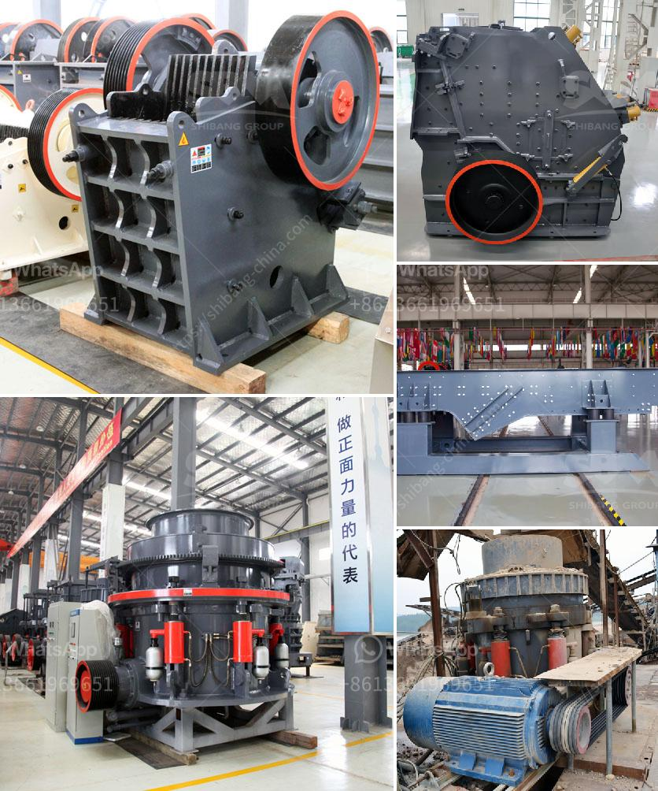

<h3>size and capasity typical jaw crusher</h3>
A jaw crusher is a type of primary crusher used in mines and ore processing plants. Jaw crushers are designed to crush the toughest materials through the use of compressive force (pressure). The jaw crusher design includes a set of two vertical jaws—a fixed (stationary) jaw and a swing (reciprocating) jaw. The swing jaw moves back and forth by a cam or pitman mechanism, acting like a nutcracker or a class II lever.

The size and capacity of a jaw crusher are determined by the feed opening and the discharge opening, both of which affect the throughput and production rate. A larger feed opening allows raw materials to be fed into the crusher more efficiently, reducing the risk of bridging (blockages) and maximizing the crushers' capacity to process larger rocks or ores.

Typical jaw crushers have a feed opening ranging from 450 mm to 1200 mm, with maximum feed sizes ranging from 400 mm to 900 mm. The capacity of jaw crushers is also influenced by the size and shape of the crushing chamber, the angle of the toggle plate, and the stroke (throw) of the swing jaw.

To ensure high production rates and prevent damage to the crusher, the optimum feed size should be between 80% and 85% of the jaw opening. This allows the crusher to operate efficiently, decreasing the wear and tear on the crushing surfaces and minimizing the occurrence of oversized materials.

The capacity of a jaw crusher is directly related to its size and design features. For example, a 48-inch (120 cm) jaw crusher has a capacity of 350-450 tonnes per hour, while a 12 inch (30 cm) jaw crusher has a smaller capacity of 10-40 tonnes per hour.

Jaw crushers are primarily used as primary crushers in mining and aggregate production operations where large rocks or ores need to be crushed into smaller particles for further processing or use. They are commonly used in quarries, construction sites, and recycling applications due to their versatile nature and ability to handle a wide range of materials.

In conclusion, the size and capacity of a jaw crusher play a crucial role in its performance and efficiency. The feed opening, discharge opening, and crushing chamber geometry determine the maximum feed size, production capacity, and product size distribution. Properly sized jaw crushers can process large rocks or ores efficiently while minimizing the risk of blockages and maximizing production. It is essential to consider the specific requirements of your application when selecting a jaw crusher, ensuring it meets your production goals and operates optimally.
<h3>Contact us</h3><ul><li><strong>Whatsapp:&nbsp;<a href="https://wa.me/8613661969651">+8613661969651</a></strong></li><li><a href="https://swt.shibang-china.com/?git&amp;zhl&amp;size and capasity typical jaw crusher"><strong>Online Service(chat now)</strong></a></li></ul><h3>Related</h3><ul><li><a href='high energy ball milling process.md'>high energy ball milling process</a></li><li><a href='total cost of machinery of stone crusher.md'>total cost of machinery of stone crusher</a></li><li><a href='conveyor belt capacity ton per hours.md'>conveyor belt capacity ton per hours</a></li><li><a href='enquiry about crushing machine.md'>enquiry about crushing machine</a></li><li><a href='crusher impact germany.md'>crusher impact germany</a></li></ul>