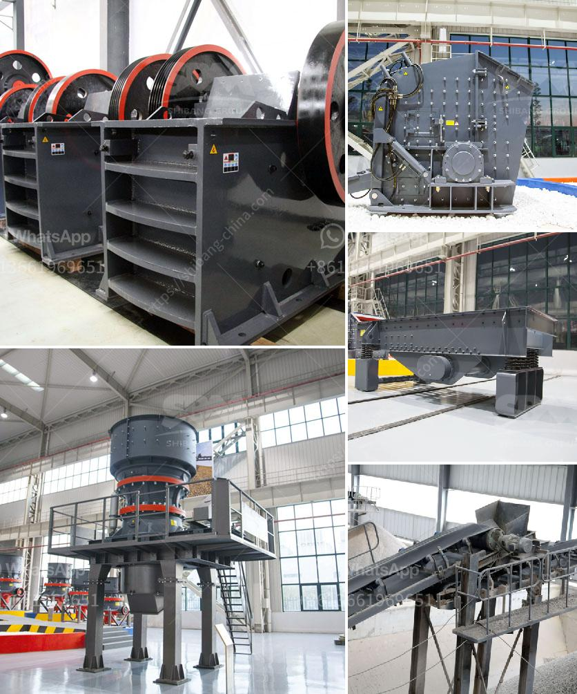

<h3>size reduction equipment ball mill in details</h3>
Size reduction equipment is a crucial part of many industrial processes. Ball mills, also known as ball grinders, are a popular choice for size reduction equipment because of their ability to grind and blend materials for use in various applications. This equipment is highly efficient, durable, and reliable, making it a cost-effective option for many businesses.

The ball mill works by using cylindrical chambers filled with grinding media, such as balls, that are made of various materials, to reduce the size of the particles in the processed material. The chambers are lined with replaceable liners, and the grinding media is replenished as the mill rotates. The material to be processed is fed into the first chamber through a hollow shaft at one end of the mill.

As the mill rotates, the grinding media crushes and grinds the material into fine particles. The grinding action is facilitated by the constant collision between the grinding media and the material inside the mill. The size of the particles is determined by the size of the openings in the grinding media and the residence time of the material inside the mill.

Ball mills are versatile machines that are used to grind materials of various hardness levels. They can operate in both wet and dry conditions, making them suitable for use in industries like mining, cement production, and cosmetic manufacturing. In addition to size reduction, ball mills can also be used for mixing, blending, or dispersing materials, making them an essential tool in many processes.

Some key advantages of ball mills include their low operating costs, minimal maintenance requirements, and high grinding efficiency. They are also known for their ability to quickly and efficiently grind large quantities of material at once. Additionally, ball mills are easy to operate and can be customized to meet the specific needs of different applications.

In conclusion, ball mills are a versatile and efficient size reduction equipment that can be used in various industrial processes. Their ability to grind and blend materials makes them a valuable asset for many businesses. Whether it's reducing the size of particles or mixing and blending materials, ball mills can deliver exceptional results while minimizing costs and maintenance requirements.
<h3>Contact us</h3><ul><li><strong>Whatsapp:&nbsp;<a href="https://wa.me/8613661969651">+8613661969651</a></strong></li><li><a href="https://swt.shibang-china.com/?git&amp;zhl&amp;size reduction equipment ball mill in details"><strong>Online Service(chat now)</strong></a></li></ul><h3>Related</h3><ul><li><a href='crushing plant company.md'>crushing plant company</a></li><li><a href='brazil best crusher manufacturing companies.md'>brazil best crusher manufacturing companies</a></li><li><a href='stone crusher machine for sale.md'>stone crusher machine for sale</a></li><li><a href='on sale used quarry machinery uk.md'>on sale used quarry machinery uk</a></li><li><a href='tanzania processing plant cost.md'>tanzania processing plant cost</a></li></ul>