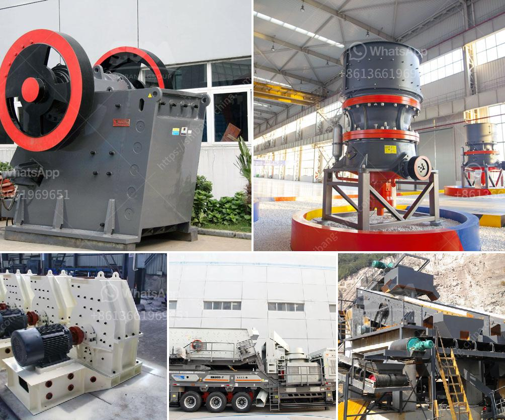

<h3>sizes of vertical shaft kilns</h3>
Vertical shaft kilns (VSKs) are important equipment in various industries, especially in the cement manufacturing process. They are characterized by their vertical orientation and ability to convert raw materials into cement or other products through a series of chemical reactions at high temperatures.

One significant aspect of VSKs is their size. The size of a vertical shaft kiln can vary depending on several factors, such as the production capacity requirements, the nature of the raw materials being processed, and the space available in the manufacturing plant.

Typically, VSKs can be classified into three main sizes: small, medium, and large. Small-sized VSKs have a production capacity ranging from 50 to 200 tons per day. These kilns are usually used in small-scale cement plants or for specialized applications where a smaller output is sufficient. They have a compact design and occupy less space, making them ideal for areas with limited land availability.

Medium-sized VSKs are commonly found in cement plants with a larger production capacity. These kilns can produce between 200 and 600 tons of cement per day. They are designed to accommodate greater quantities of raw materials and have a more robust structure. This size range is ideal for plants aiming to strike a balance between productivity and space utilization.

Large-sized VSKs are usually found in major cement production facilities. With a production capacity exceeding 600 tons per day, these kilns are highly efficient and can handle large quantities of raw materials. Due to their size and greater output, they require a significant amount of space for installation and operation. Manufacturers opting for larger VSKs generally have high production demands and a sufficient area to accommodate such equipment.

In conclusion, the size of a vertical shaft kiln is determined by multiple factors, including production requirements, raw material characteristics, and available space. Small, medium, and large VSKs cater to different plant sizes and capacities, enabling manufacturers to choose the most appropriate option for optimal productivity. Whether it is a small-scale cement plant or a large industrial facility, VSKs in varying sizes play a crucial role in the cement manufacturing process.
<h3>Contact us</h3><ul><li><strong>Whatsapp:&nbsp;<a href="https://wa.me/8613661969651">+8613661969651</a></strong></li><li><a href="https://swt.shibang-china.com/?git&amp;zhl&amp;sizes of vertical shaft kilns"><strong>Online Service(chat now)</strong></a></li></ul><h3>Related</h3><ul><li><a href='gypsum processing machine suppliers.md'>gypsum processing machine suppliers</a></li><li><a href='manufacturer of jaw crusher.md'>manufacturer of jaw crusher</a></li><li><a href='mtw series trapezium mill.md'>mtw series trapezium mill</a></li><li><a href='limestone powder mill.md'>limestone powder mill</a></li><li><a href='rubble crushers for sale.md'>rubble crushers for sale</a></li></ul>