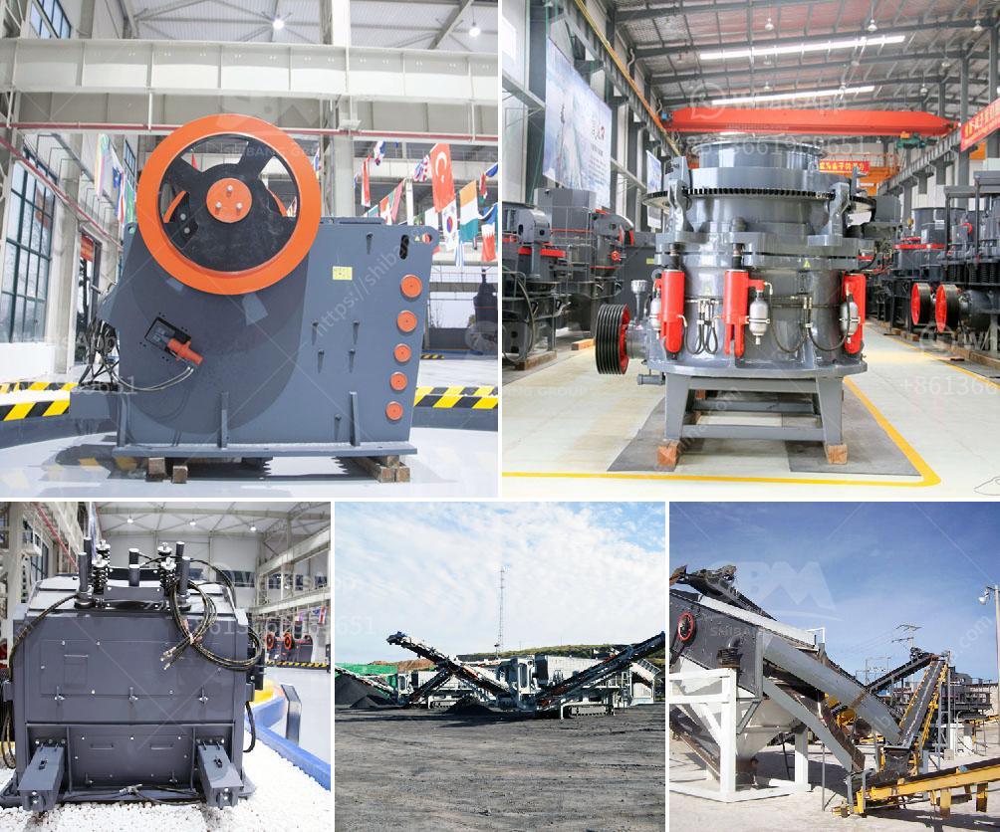

<h3>slag processing machine in australia</h3>
Slag is a waste product generated during the metal smelting process. It is formed as a result of impurities in the ore and is usually disposed of as landfill or used for construction materials, reducing its potential value. However, with advances in technology, slag processing machines are now available to extract valuable metals and minerals from this waste, turning it into a valuable resource.

Australia, being one of the world's largest producers of minerals, generates significant amounts of slag during metal smelting operations. Traditionally, this slag was considered a nuisance and an environmental concern. However, with the introduction of slag processing machines, the country could potentially recover valuable metals, such as iron, copper, and gold, as well as minerals like silica and alumina, from this waste.

Slag processing machines work by crushing and grinding the slag to liberate the valuable metals and minerals. This process is carried out in specialized mills that utilize energy-efficient methods to reduce energy consumption and minimize environmental impact. Once the slag is processed, it can be further refined into valuable products that can be used in various industries.

One of the primary advantages of utilizing slag processing machines in Australia is the potential for cost savings. By extracting metals and minerals from slag, companies can reduce the need for expensive mining operations and decrease their reliance on finite natural resources. This not only benefits the environment but also contributes to a more sustainable and economically viable future.

Moreover, the recovered metals and minerals can be sold as raw materials or used in various industries, including construction, manufacturing, and agriculture. For example, iron recovered from slag can be used in steel production, reducing the need for virgin iron ore extraction. Similarly, silica and alumina derived from slag processing can be used in the production of ceramics and cement, respectively.

In addition to economic benefits, slag processing machines also offer environmental advantages. By reducing the amount of waste sent to landfills, these machines help minimize the environmental impact of metal smelting operations. Furthermore, the extraction of valuable metals and minerals from slag helps conserve natural resources and reduces the need for mining, which often leads to habitat destruction and contributes to greenhouse gas emissions.

It is worth mentioning that slag processing machines require proper maintenance and regular servicing to ensure optimal performance. This includes routine inspections, lubrication, and replacement of worn-out parts. By investing in the maintenance of these machines, companies can ensure their longevity and maximize their efficiency.

In conclusion, the utilization of slag processing machines in Australia presents a significant opportunity to turn a waste product into a valuable resource. These machines enable the extraction of valuable metals and minerals from slag, offering economic and environmental benefits. By doing so, Australia can reduce its reliance on finite natural resources, contribute to a more sustainable future, and create new opportunities for industries that rely on these recovered materials.
<h3>Contact us</h3><ul><li><strong>Whatsapp:&nbsp;<a href="https://wa.me/8613661969651">+8613661969651</a></strong></li><li><a href="https://swt.shibang-china.com/?git&amp;zhl&amp;slag processing machine in australia"><strong>Online Service(chat now)</strong></a></li></ul><h3>Related</h3><ul><li><a href='china stone crusher closed circuit.md'>china stone crusher closed circuit</a></li><li><a href='ball mill in peru.md'>ball mill in peru</a></li><li><a href='power draw calculator of ball mill.md'>power draw calculator of ball mill</a></li><li><a href='to start small stone crusher plant.md'>to start small stone crusher plant</a></li><li><a href='cement mill liner manufacturers in india.md'>cement mill liner manufacturers in india</a></li></ul>