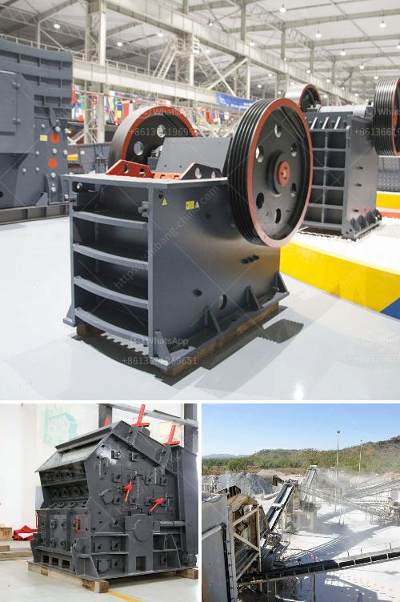

<h3>small crusher project</h3>
In a rapidly developing world, where industries are booming and construction is at its peak, the necessity of sustainable projects that minimize waste and utilize resources efficiently has become more crucial than ever. One such project that holds immense potential is the small crusher project. This innovative approach aims to transform waste into valuable resources, simultaneously addressing the mounting environmental concerns and contributing to a sustainable future.

The small crusher project revolves around the idea of utilizing crushers - machines that break down tough materials into smaller, more manageable pieces. These crushers can efficiently process various materials like concrete, asphalt, and bricks, often discarded as waste in construction sites. Implementing this project not only helps in reducing waste but also provides an avenue for recycling and reusing these materials.

Firstly, the small crusher project aims at reducing the environmental impact of waste disposal. By crushing materials that would otherwise be left to rot in landfills, the project promotes responsible waste management. This simple process significantly reduces the volume of waste, preventing the needless occupation of valuable land and reducing greenhouse gas emissions associated with waste decomposition. Additionally, as these crushers can be deployed directly at construction sites, the transportation costs and carbon footprint associated with hauling waste to distant recycling facilities are also minimized.

Secondly, the small crusher project plays a pivotal role in recycling and reusing materials effectively. By crushing materials like concrete, which can be reused as aggregate in new construction projects, the project lessens the demand for virgin resources. This not only conserves natural resources but also reduces the need for energy-intensive manufacturing processes required to produce fresh aggregates. Such recycling initiatives have the potential to create a circular economy, wherein waste materials are reincorporated into new products, promoting sustainable development.

Moreover, the small crusher project holds immense economic benefits. With the rise in demand for recycled materials, there is a growing market for crushed waste products. By processing these materials locally, small-scale businesses can emerge, generating employment opportunities and driving economic growth. Furthermore, as the demand for recycled materials increases, the cost of construction can be reduced, making projects more affordable and accessible to a wider range of individuals and communities.

Implementing the small crusher project requires collaboration between stakeholders, including government authorities, construction companies, and environmental organizations. Policymakers need to provide incentives and streamlined regulations to encourage the adoption of crusher machines. Construction companies should actively participate by incorporating crusher units into their operations and promoting the use of recycled materials in their projects. Environmental organizations can support and create awareness about the benefits of small crusher projects, urging communities to embrace sustainable practices.

In conclusion, the small crusher project offers a practical and effective solution to the mounting environmental concerns and resource scarcity. By breaking down waste materials into reusable resources, the project minimizes waste, promotes recycling, reduces the carbon footprint, and brings economic benefits. It is high time that we recognize the potential of small crusher projects and work towards their widespread implementation, leaving a positive impact on the environment, economy, and society at large.
<h3>Contact us</h3><ul><li><strong>Whatsapp:&nbsp;<a href="https://wa.me/8613661969651">+8613661969651</a></strong></li><li><a href="https://swt.shibang-china.com/?git&amp;zhl&amp;small crusher project"><strong>Online Service(chat now)</strong></a></li></ul><h3>Related</h3><ul><li><a href='lime stone processing machine.md'>lime stone processing machine</a></li><li><a href='granite aggregate quarry machinary for sale.md'>granite aggregate quarry machinary for sale</a></li><li><a href='stone crusher equipment supplier.md'>stone crusher equipment supplier</a></li><li><a href='small stone crushers for sale.md'>small stone crushers for sale</a></li><li><a href='jaw crusher materials.md'>jaw crusher materials</a></li></ul>