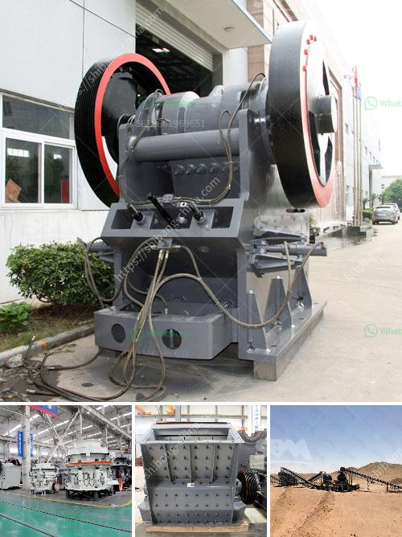

<h3>small gravel crushers</h3>
Small gravel crushers are widely used in small-scale mining and quarrying industry for the clients. They are suitable for crushing hard and soft ores into small pieces and sand. Small gravel crushers can be divided into small jaw crusher, small impact crusher, small cone crusher, and small VSI crusher according to their functions.

Small jaw crusher is one of the most commonly used crushing equipment in mining industry. It is mainly used for the coarse crushing of materials including gravel, pebble, granite, quartz, etc. Small jaw crusher ensures the crushing capacity and output size range, which are also crucial factors for customers to choose crushers.

Small impact crusher is a useful equipment in the crushing and grinding industry. It is often used for crushing limestone, coal, calcium carbide, quartz, dolomite, iron sulfide ore, gypsum, and other minerals. Small impact crusher can crush the materials with the size less than 500mm and compression strength less than 350MPa, such as granite, limestone, and concrete.

Small cone crusher is suitable for crushing various of mid-hard and hard ores and rocks. It has the advantages of reliable structure, high efficiency, easy adjustment, and economic operation. Small cone crusher is widely used in metallurgical industry, construction industry, chemical industry, and phosphate industry.

Small VSI crusher, also called small sand making machine, plays an important role in the sand production line. Compared with the traditional sand making equipment, small VSI crusher has good performance and high sand production rate. It is an ideal choice for small industries to produce high-quality sand.

In conclusion, small gravel crushers are essential pieces of equipment for small-scale mining and quarrying industry. They can help clients quickly and efficiently crush the materials into small pieces and sand. Choosing the right type of small gravel crusher depends on the specific requirements of the clients, such as the crushing capacity, output size range, and the materials to be crushed.
<h3>Contact us</h3><ul><li><strong>Whatsapp:&nbsp;<a href="https://wa.me/8613661969651">+8613661969651</a></strong></li><li><a href="https://swt.shibang-china.com/?git&amp;zhl&amp;small gravel crushers"><strong>Online Service(chat now)</strong></a></li></ul><h3>Related</h3><ul><li><a href='stone crusher price in india.md'>stone crusher price in india</a></li><li><a href='roller mill calcium.md'>roller mill calcium</a></li><li><a href='price of iron ore crusher machine.md'>price of iron ore crusher machine</a></li><li><a href='stone crusher plant kapasitas 60 ton h.md'>stone crusher plant kapasitas 60 ton h</a></li><li><a href='operating a granite quarry crusher in nigeria.md'>operating a granite quarry crusher in nigeria</a></li></ul>