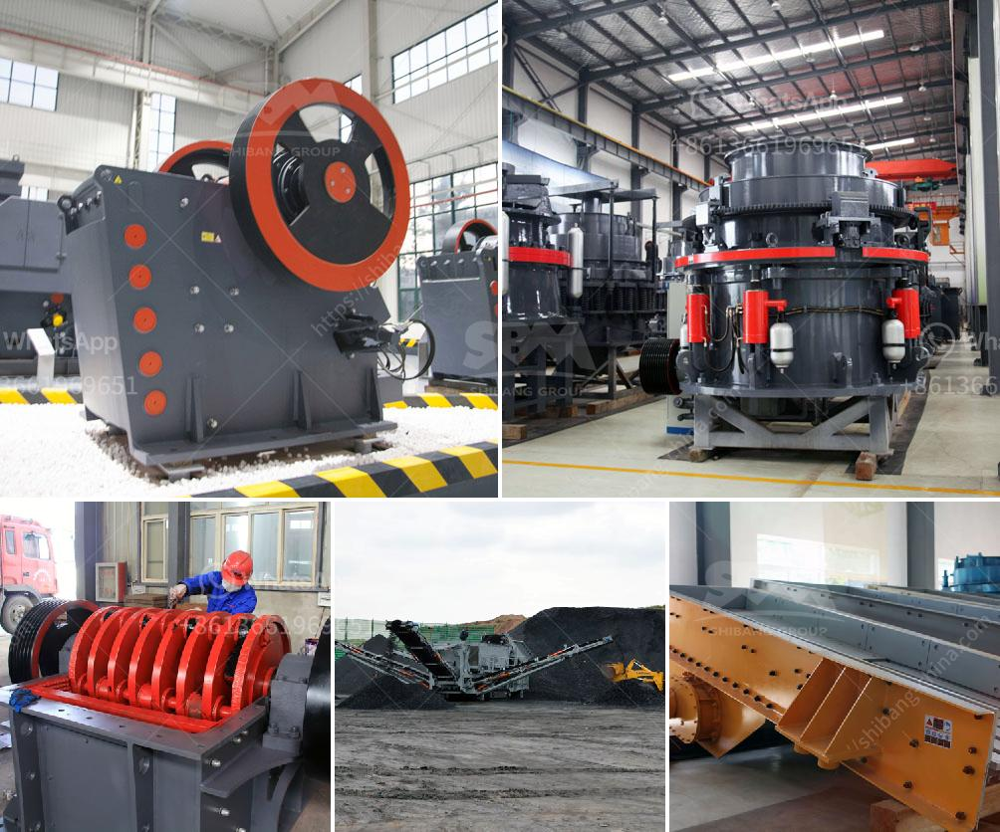

<h3>small limestone plant</h3>
A small limestone plant may not be as grandiose as its larger counterparts, but it plays a vital role in various industries. Limestone is a sedimentary rock that is primarily composed of calcium carbonate, and it has a wide range of uses due to its versatility and abundance. This article aims to shed light on the significance of small limestone plants and the impact they have on different sectors.

One of the main industries that heavily relies on limestone is the construction sector. Limestone is crushed into various sizes and used as a key component in road construction, concrete production, and building foundations. Its durability and strength make it a favored material for these purposes. A small limestone plant contributes to meeting the demand for limestone in local construction projects, ensuring a steady supply of this crucial resource.

Similarly, the agriculture industry benefits from the presence of small limestone plants. Limestone is commonly used as a soil amendment to neutralize acidic soils. It helps to regulate the pH level and improves the fertility of the soil, creating an optimal environment for crops to thrive. By supplying limestone to nearby farmlands, small plants play a vital role in ensuring sustainable and productive agricultural practices.

Another industry that relies on limestone is the manufacturing sector, particularly in the production of products like glass and paper. In the glass industry, limestone is a key ingredient in the manufacturing of glass bottles, windows, and other glass products. The calcium carbonate found in limestone acts as a flux, reducing the melting temperature of the glass and improving its transparency.

Limestone is also an essential component in the paper industry. It is used as a filler material to improve paper quality, enhance its brightness, and increase its opacity. By providing limestone to local paper mills, small plants support the smooth operation of this vital industry, ensuring a continuous supply of high-quality paper for various purposes.

Additionally, small limestone plants contribute to the local economy by creating job opportunities for the community. These plants require a workforce to manage the extraction, crushing, and processing of limestone. By providing employment opportunities, small plants improve the living standards of the local population, fostering economic growth and development in the area.

Environmental considerations are also a crucial aspect of small limestone plants. The quarrying of limestone might have some impact on the natural environment. However, small plants are typically subject to stricter regulations and have smaller footprints compared to larger operations. By adhering to environmentally friendly practices and implementing mitigation measures, small plants can mitigate their ecological impact and minimize disturbances to nearby ecosystems.

In conclusion, small limestone plants may not grab headlines like giant industrial operations, but they play a critical role in various industries. These plants supply limestone to the construction, agriculture, manufacturing, and other sectors, helping to meet the demand for this versatile and essential rock. Moreover, they provide employment opportunities and contribute to the local economy while ensuring environmental sustainability. The significance of small limestone plants lies in their ability to support vital industries while promoting community growth and responsible resource management.
<h3>Contact us</h3><ul><li><strong>Whatsapp:&nbsp;<a href="https://wa.me/8613661969651">+8613661969651</a></strong></li><li><a href="https://swt.shibang-china.com/?git&amp;zhl&amp;small limestone plant"><strong>Online Service(chat now)</strong></a></li></ul><h3>Related</h3><ul><li><a href='gold milling equipment prices.md'>gold milling equipment prices</a></li><li><a href='gold mining equipment companies in china.md'>gold mining equipment companies in china</a></li><li><a href='vertical coal mill manufacturer in china.md'>vertical coal mill manufacturer in china</a></li><li><a href='enquiry about crushing machine.md'>enquiry about crushing machine</a></li><li><a href='conveyor belts in horizontal position.md'>conveyor belts in horizontal position</a></li></ul>