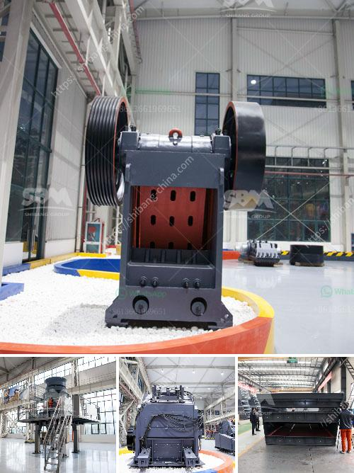

<h3>small mobile stone crusher price in russia</h3>
Russia is one of the largest countries in the world with vast reserves of oil, natural gas, coal, and many other minerals. The construction industry in Russia is booming, which provides a constant demand for better infrastructure, building materials, and reliable stone crushers. Just like in other countries, Russia's mining and construction industries are also facing the challenge of meeting the increasing demand for more efficient and cost-effective crushers. This is where small mobile stone crushers come into play.

Small mobile stone crushers are designed for small scale mining, quarrying, construction, and demolition activities. They are popular due to their flexibility, easy transportation, and low operating costs. Mobile stone crushers can bring various benefits for their users, such as eliminating the need for foundation construction, providing access to remote sites, and reducing transportation costs.

When it comes to the price of small mobile stone crushers in Russia, there are many factors contributing to the competitiveness of the machines. The most important factor is the technical level of the machines. A good mobile crusher must have advanced technology and reliable performance. Higher technical level ensures a more efficient crushing process and higher productivity, which directly impacts the overall cost of the crusher.

Another factor affecting the price of small mobile stone crushers in Russia is the price of raw materials. The high quality raw materials used in the production of crushers contribute to the long service life and low maintenance costs. Therefore, the prices of raw materials strongly influence the price of the crusher.

Moreover, the production cost of small mobile stone crushers is also affected by various government policies. Taxes, tariffs, and labor costs can significantly impact the overall cost of a mobile stone crusher. Furthermore, the price of small mobile stone crushers also depends on the geographic location, distance from the manufacturer, and the size of the machine.

In order to find the best price for small mobile stone crushers, customers should take various factors into consideration. Firstly, they should establish their needs and requirements for the crusher. This includes determining the capacity, output size, and functions required. Secondly, customers should compare the prices and technical parameters of different manufacturers. This can be done through online research, visiting exhibitions, or contacting local distributors.

It's worth mentioning that the cheapest price does not necessarily mean the best quality. Customers should focus on the overall cost-effectiveness of the crusher, including its performance, durability, and after-sales service. It's important to choose a reliable and reputable manufacturer that offers good quality products and excellent customer support.

In conclusion, the price of small mobile stone crushers in Russia depends on multiple factors, such as the technical level, quality of raw materials, government policies, and geographic location. Customers should carefully evaluate these factors and choose the most suitable option based on their needs and budget. With the right choice, small mobile stone crushers offer a cost-effective solution for Russia's mining and construction industries.
<h3>Contact us</h3><ul><li><strong>Whatsapp:&nbsp;<a href="https://wa.me/8613661969651">+8613661969651</a></strong></li><li><a href="https://swt.shibang-china.com/?git&amp;zhl&amp;small mobile stone crusher price in russia"><strong>Online Service(chat now)</strong></a></li></ul><h3>Related</h3><ul><li><a href='cost new jaw crusher.md'>cost new jaw crusher</a></li><li><a href='gold stamping mill prices in south africa.md'>gold stamping mill prices in south africa</a></li><li><a href='price of stone crusher machine in pakistan.md'>price of stone crusher machine in pakistan</a></li><li><a href='jual mesin limestone crusher.md'>jual mesin limestone crusher</a></li><li><a href='hydraulic roll crusher zenith.md'>hydraulic roll crusher zenith</a></li></ul>