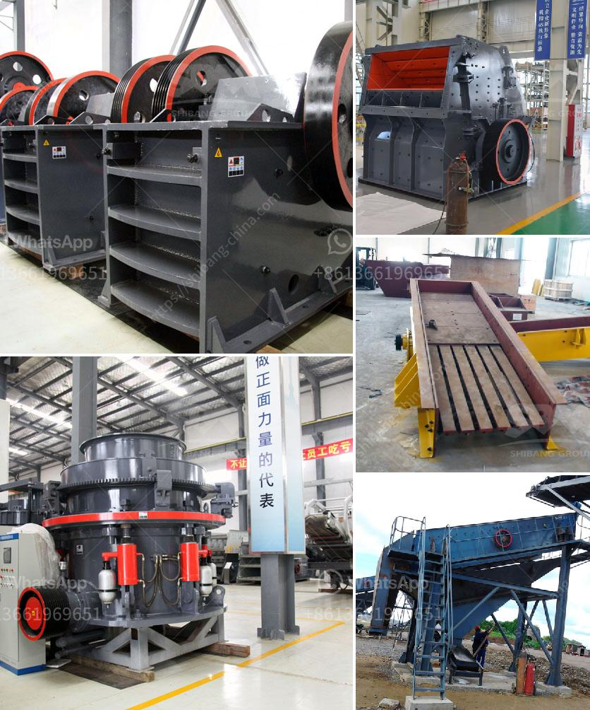

<h3>small portable crusher for laboratory purpose in india</h3>
India is a vast country with diverse terrain and resources. In such a vast territory, the need for various construction materials such as sand, crushed stones, gravel, and concrete is inevitable. To meet these demands, the mining industry plays a crucial role in India’s economic growth. Particularly in laboratory testing, small portable crushers are used for sample preparation during the mineral and ore testing process.

A laboratory crusher, also known as a pulverizer or crushers, is a machinery designed to reduce large rocks into smaller rocks, gravel, or rock dust. It is compact and of rugged construction for general laboratory use. Small portable crushers are ideal for small-scale mining and industrial applications for crushing a variety of materials such as coal, ores, minerals, and aggregates.

Laboratory crushers have a wide range of applications and can process various materials effortlessly. They can be used in the mining and metallurgical industries, construction, aggregate testing, coal preparation, soil testing, and many more. The crushers crush the materials into finer particles for further analysis, testing, or usage in different processes.

Advances in technology have made it possible to have small portable crushers for laboratory purposes in India. These crushers are compact, lightweight, and easy to transport, making them suitable for remote locations or areas with limited access. They are specifically designed to provide efficient and reliable sample preparation for laboratory testing.

The small portable crusher for laboratory purpose in India is equipped with wheels for easy transportation. It is designed to be easily moved from one location to another and can be set up in seconds. This mobility allows for flexibility in testing locations, enabling the user to take the crusher directly to the source of the material being tested.

In terms of performance, these small portable crushers are designed to deliver consistent results. They have a powerful motor and robust construction to withstand the demands of laboratory testing. The crushers are equipped with a variety of safety features to ensure the operator's safety while operating the equipment.

One of the advantages of using a small portable crusher for laboratory purpose in India is the cost-effectiveness. These crushers are affordable and provide an economical solution for laboratory testing. They are energy-efficient and require minimal maintenance, resulting in reduced operational costs.

Furthermore, small portable crushers contribute to environmental sustainability. They produce less noise and vibration compared to larger crushers, minimizing the impact on the surrounding environment. Moreover, they have a smaller carbon footprint, reducing greenhouse gas emissions.

In conclusion, small portable crushers for laboratory purpose in India have revolutionized the testing and analysis process of various materials. They are compact, easy to transport, and perform efficiently, making them ideal for laboratory use. With their affordability, reliability, and environmental sustainability, these crushers are an indispensable tool for any laboratory or testing facility. They enable accurate and reliable results in the mineral and ore testing process, contributing to the overall growth and development of the mining industry in India.
<h3>Contact us</h3><ul><li><strong>Whatsapp:&nbsp;<a href="https://wa.me/8613661969651">+8613661969651</a></strong></li><li><a href="https://swt.shibang-china.com/?git&amp;zhl&amp;small portable crusher for laboratory purpose in india"><strong>Online Service(chat now)</strong></a></li></ul><h3>Related</h3><ul><li><a href='marble processing machine.md'>marble processing machine</a></li><li><a href='gypsum board manufacturing machine india.md'>gypsum board manufacturing machine india</a></li><li><a href='quartz marble making machine.md'>quartz marble making machine</a></li><li><a href='500 ton per hr crusher price.md'>500 ton per hr crusher price</a></li><li><a href='petimex impact crushers manial petite.md'>petimex impact crushers manial petite</a></li></ul>