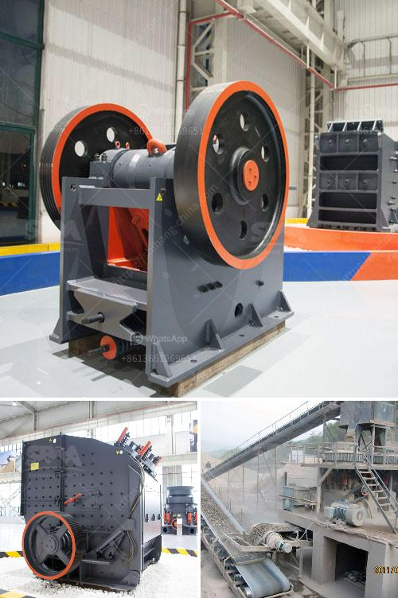

<h3>small portable swing jaw crushers</h3>
Crushing is an integral part of mining and construction operations. It is essential for reducing the size of materials for further processing or disposal. In recent years, the demand for smaller and more portable crushing equipment has increased significantly, as it offers numerous advantages in terms of flexibility, convenience, and cost-effectiveness. One such compact and efficient solution is the small portable swing jaw crusher.

These portable crushers, also known as mobile jaw crushers, are designed for rapid movement and quick installation. They are equipped with unique features that facilitate easy transportation, making them ideal for on-site crushing tasks. Whether it's road construction, demolition work, or recycling projects, these portable crushers can save considerable time and money.

The swing jaw crusher mechanism employed in these crushers utilizes a single-toggle design. It delivers smooth operation with high productivity and minimal wear and tear. The swing motion of the jaw ensures efficient crushing of materials, while the compact design allows for tight spaces and easy maneuverability. This makes them perfect for use in urban areas or confined job sites.

Furthermore, with their small size and lightweight construction, these crushers can be transported easily on a truck or trailer. They can be swiftly set up at the desired location, eliminating the need for extensive groundwork. As a result, downtime is reduced, and productivity is maximized.

The versatility of small portable swing jaw crushers is another remarkable feature. They can handle a wide range of materials, from hard rocks to soft and abrasive ones. Additionally, with adjustable settings, different-sized output can be achieved, catering to diverse customer requirements.

In conclusion, small portable swing jaw crushers offer a convenient and efficient crushing solution for various applications. Their compact size, lightweight construction, and swift installation make them ideal for on-site operations. With their versatility, these crushers can process different materials and deliver multiple output sizes. These crushers are increasingly being preferred by contractors and operators worldwide for their cost-effectiveness and ease of use.
<h3>Contact us</h3><ul><li><strong>Whatsapp:&nbsp;<a href="https://wa.me/8613661969651">+8613661969651</a></strong></li><li><a href="https://swt.shibang-china.com/?git&amp;zhl&amp;small portable swing jaw crushers"><strong>Online Service(chat now)</strong></a></li></ul><h3>Related</h3><ul><li><a href='marble mining equipment manufacturers.md'>marble mining equipment manufacturers</a></li><li><a href='crushing machine in.md'>crushing machine in</a></li><li><a href='crushing plant limestone.md'>crushing plant limestone</a></li><li><a href='quartz ball mill.md'>quartz ball mill</a></li><li><a href='mica processing equipment.md'>mica processing equipment</a></li></ul>