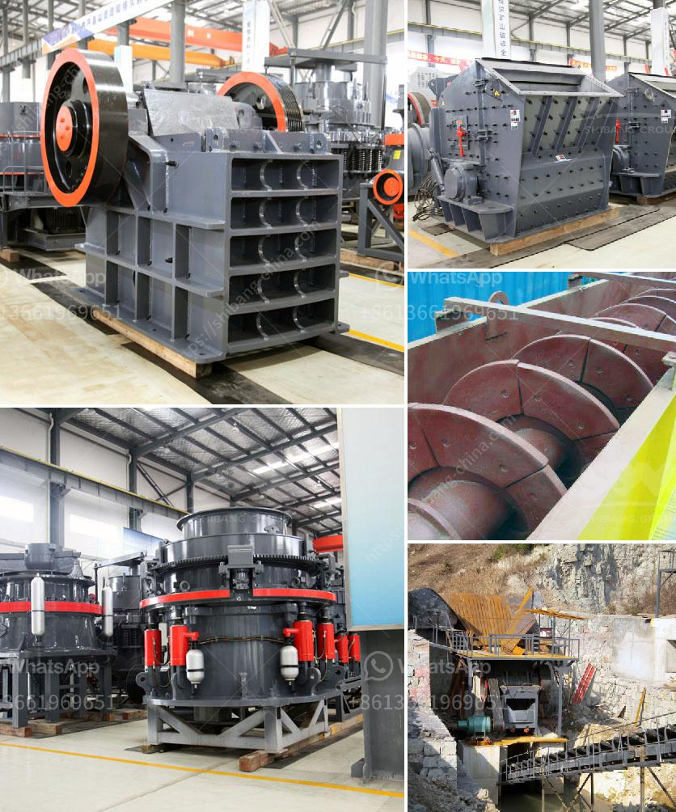

<h3>small profile format for crusher company</h3>
A small profile format for a crusher company is a concise and informative summary that showcases the key aspects of the company. With just 100-300 words, the profile is designed to capture the attention of potential customers and provide them with an overview of the company's products and services. 

ABC Crusher Company, a renowned name in the industry, specializes in providing high-quality crushing solutions for various sectors. With years of expertise and experience, we have established ourselves as one of the leading crusher manufacturers in the market.

At ABC Crusher Company, our primary focus is to deliver top-notch equipment that efficiently breaks down materials and enhances productivity. Our wide range of crushers includes jaw crushers, cone crushers, and impact crushers, specifically designed to meet the diverse crushing needs of our clients.

Quality is at the core of everything we do. We employ advanced technology and strict quality control measures to ensure that our crushers are durable, reliable, and efficient. Our dedicated team of engineers and skilled technicians work tirelessly to manufacture products that exceed industry standards.

Customer satisfaction is our utmost priority. We understand that each client has unique requirements, and we strive to provide customized solutions that address their specific needs. Our team works closely with clients to understand their project requirements and recommend the most suitable crusher for their application.

Furthermore, we offer comprehensive after-sales support to ensure optimal performance and longevity of our crushers. Our expert technicians provide installation, maintenance, and repair services, along with readily available spare parts and prompt technical assistance.

ABC Crusher Company takes pride in its commitment to sustainability. We prioritize eco-friendly practices throughout our production process, striving to minimize waste generation and reduce our carbon footprint.

In conclusion, ABC Crusher Company is a trusted name in the industry, known for delivering superior quality crushers and exceptional customer service. With our extensive range of products, personalized solutions, and unwavering commitment to sustainability, we are your ideal partner for all your crushing needs. Contact us today to experience the excellence that sets us apart.
<h3>Contact us</h3><ul><li><strong>Whatsapp:&nbsp;<a href="https://wa.me/8613661969651">+8613661969651</a></strong></li><li><a href="https://swt.shibang-china.com/?git&amp;zhl&amp;small profile format for crusher company"><strong>Online Service(chat now)</strong></a></li></ul><h3>Related</h3><ul><li><a href='indonesia crushers of how much price.md'>indonesia crushers of how much price</a></li><li><a href='gypsum mining crusher dubai.md'>gypsum mining crusher dubai</a></li><li><a href='safety operation of crusher.md'>safety operation of crusher</a></li><li><a href='coal crusherton per hours.md'>coal crusherton per hours</a></li><li><a href='double sided fine grinding machines price.md'>double sided fine grinding machines price</a></li></ul>