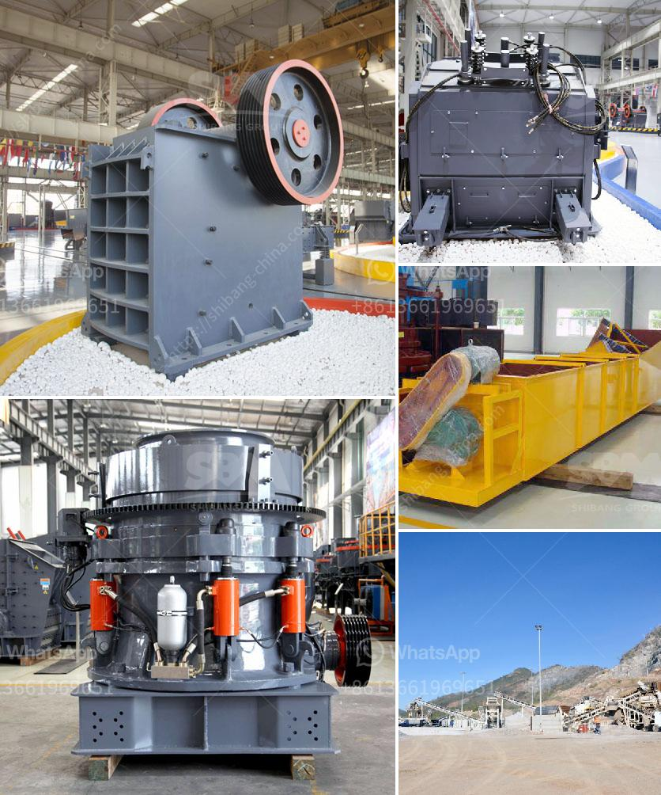

<h3>small rock crusher machine</h3>
Crushing rocks is not an easy task. Although rock crushers can make it seem simple, understanding the process of breaking down large rocks into smaller pieces is essential for consistent results. Small rock crusher machines are designed with advanced technology and stringent quality control, helping you to attain the perfect product for your specific application.

One of the main advantages of a small rock crusher machine is its versatility. Whether you need to crush rocks, coal, ore, or other materials for construction or industrial purposes, a rock crusher can help you efficiently and effectively complete your task. With a compact and portable design, these machines take up minimal space, making them ideal for small-scale operations or projects with limited space.

The efficiency of a small rock crusher machine is further enhanced by its ability to process materials quickly. This feature allows you to save time and increase productivity, making it an excellent investment in productivity and efficiency. Additionally, the machine's durability ensures longevity and helps withstand extreme conditions, ensuring reliable performance even in challenging environments.

Maintenance and cost are key considerations when investing in a small rock crusher machine. These machines are designed to be low maintenance, reducing downtime and increasing productivity. Additionally, the cost of operation is significantly lower compared to larger crushers, making small rock crusher machines a cost-effective investment.

When choosing a small rock crusher machine, consider several factors. First, assess the capacity of the machine to ensure that it matches your needs. This will depend on the amount and size of the rocks you need to crush. Additionally, consider the power source and energy requirements of the machine. Opting for a machine that operates on electricity can save on fuel costs and reduce carbon emissions.

Size and portability are also important factors to consider. Ensure that the machine is compact and portable enough to be easily transported and used on various job sites. This flexibility allows you to maximize the efficiency and effectiveness of the machine across different applications, eliminating the need for multiple machines.

When purchasing a small rock crusher machine, look for reputable manufacturers with a proven track record. Companies with years of experience and positive customer feedback are more likely to provide reliable and high-quality machines. Additionally, check for warranties and after-sales service to ensure any potential issues are swiftly resolved.

In conclusion, a small rock crusher machine is an excellent investment for anyone in need of crushing rocks efficiently and cost-effectively. With its versatile design and ability to process materials quickly, these machines offer a reliable solution for various applications. Consider factors such as capacity, power source, and portability when selecting the right machine for your needs. Ultimately, investing in a small rock crusher machine is a wise move that will enhance productivity and contribute to the success of your projects.
<h3>Contact us</h3><ul><li><strong>Whatsapp:&nbsp;<a href="https://wa.me/8613661969651">+8613661969651</a></strong></li><li><a href="https://swt.shibang-china.com/?git&amp;zhl&amp;small rock crusher machine"><strong>Online Service(chat now)</strong></a></li></ul><h3>Related</h3><ul><li><a href='construction equipment made in taiwan.md'>construction equipment made in taiwan</a></li><li><a href='copper crusher exporter in south africa.md'>copper crusher exporter in south africa</a></li><li><a href='gold sand mining machine.md'>gold sand mining machine</a></li><li><a href='granite crushing per tonne.md'>granite crushing per tonne</a></li><li><a href='tph stationery stone crushing plant.md'>tph stationery stone crushing plant</a></li></ul>