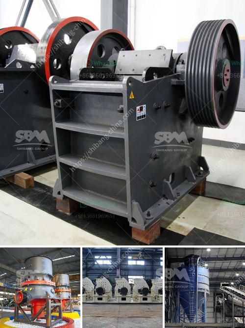

<h3>small rock crusher mining</h3>
Small rock crusher, also called as mini stone crushing machine, is such a machine which is designed for the large rocks decrease becoming small rock, gravel, or rock dust. It will produce the gravel stones and the mining ores, or the filling material used to beautify and erosion control. They can be used with the cement making machine. Small rock crusher can move (though usually is very heavy), and it also can be fixed.

As China's economic construction is growing, the domestic real estate and high-speed way construction develops rapidly, which make small rock crusher industry has a rapid development. Small rock crusher production specifications will be from single crusher development to a variety of specifications and various types of a variety of small crusher. Compound crusher, one of the new types of small rock crusher, also develops gradually. It has a significantly improvement of compound rock crusher recent years.

Therefore, on the premise of energy saving and reducing consumption, high technology small rock crusher will be a big trend in the development of crushing machinery industry in the future.

Small rock crusher design is novel which adopts the design principle of the new concept crushing technology. This machine can satisfy the crushing requirements of different material. Small rock crusher will meet the new technology of "more crushing less grinding" requirements. It has large crushing ratio, uniform and fine end products. The unit power consumption is low and it has fewer requirements for the crushed materials' humidity requirements.

It is also suitable for any hard brittle materials or other various kinds of minerals. Through large engineering, the small rock crusher shows that it has good application prospect in the field of mineral processing equipment.

There are many factors impacting the small rock crusher production capacity: The hardness of the material. More hard material, it is more difficult to break, and this will cause serious wear. When the machine crushes hard materials, it has slow crushing speed and the crushing capacity will be small. The humidity of materials. When the material has large moisture content, it is easy adhesion when the small rock crusher works. It is also affected by the humid air and the materials' moisture content is greater than 8%. Small rock crusher structure. Nowadays, the component of small rock crusher mainly includes feeding, crushing, screening, and conveying, etc. 

As the professional manufacturer of complete sets of mining machinery, such as vibrating screen, stone crusher plant, Henan Hongxing is always doing the best in products and service.
<h3>Contact us</h3><ul><li><strong>Whatsapp:&nbsp;<a href="https://wa.me/8613661969651">+8613661969651</a></strong></li><li><a href="https://swt.shibang-china.com/?git&amp;zhl&amp;small rock crusher mining"><strong>Online Service(chat now)</strong></a></li></ul><h3>Related</h3><ul><li><a href='barite bulking process.md'>barite bulking process</a></li><li><a href='grinding raymond mill.md'>grinding raymond mill</a></li><li><a href='quartz production process.md'>quartz production process</a></li><li><a href='ball mill machine in nigeria.md'>ball mill machine in nigeria</a></li><li><a href='clay crushers for clay crushing process.md'>clay crushers for clay crushing process</a></li></ul>