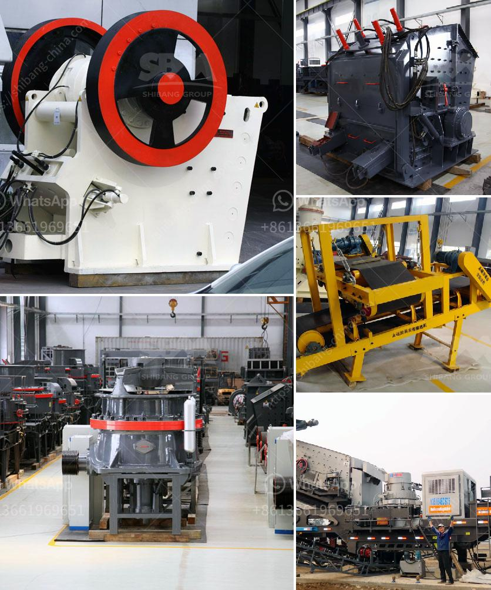

<h3>small rock gravel crushers</h3>
Small rock gravel crushers are the perfect piece of equipment for any construction or landscaping project. These crushers are specifically designed for reducing the size of rocks, gravels, and stones to a smaller size for further use. Whether it is for road construction, railway ballast, or landscape gravel, these small crushers are an essential tool.

One of the main advantages of small rock gravel crushers is their portability. Unlike larger crushers, which require heavy machinery and time-consuming transportation, these compact crushers can be easily transported from one site to another. This makes them ideal for small-scale projects that require crushing at multiple locations. Additionally, their small size allows for easy maneuverability in tight spaces, making them suitable for both indoor and outdoor applications.

Another benefit of small rock gravel crushers is their efficiency. With a powerful motor and crushing jaws, these crushers can quickly and effectively reduce the size of rocks and gravels. This helps to save time and energy, as well as reducing the need for manual labor. The crushed material can then be used for various purposes, such as foundation fill, drainage, or decorative landscaping.

Small rock gravel crushers are also cost-effective. They are typically more affordable than larger crushers, making them a budget-friendly option for contractors and homeowners. Additionally, these crushers operate on standard power sources, such as electricity or diesel, which are readily available and inexpensive. This further helps to keep the operational costs low.

Furthermore, small rock gravel crushers are user-friendly. Most models feature a simple and intuitive control panel, allowing even inexperienced users to operate the machine efficiently. Many crushers also come with safety features, such as emergency stop buttons and safety guards, ensuring the well-being of the user. Additionally, regular maintenance and servicing are easy tasks that can be easily conducted by the operator.

In conclusion, small rock gravel crushers are versatile and essential equipment for any construction or landscaping project. Their portability, efficiency, and cost-effectiveness make them a valuable tool for both professionals and DIY enthusiasts. Whether it is for residential landscaping or commercial construction, these crushers can help to transform rocks and gravels into usable materials. With their user-friendly features, these crushers are suitable for operators of all experience levels. Invest in a small rock gravel crusher today and streamline your construction and landscaping projects.
<h3>Contact us</h3><ul><li><strong>Whatsapp:&nbsp;<a href="https://wa.me/8613661969651">+8613661969651</a></strong></li><li><a href="https://swt.shibang-china.com/?git&amp;zhl&amp;small rock gravel crushers"><strong>Online Service(chat now)</strong></a></li></ul><h3>Related</h3><ul><li><a href='turnkey project for gypsum board manufacturing plant.md'>turnkey project for gypsum board manufacturing plant</a></li><li><a href='crush calcite equipment.md'>crush calcite equipment</a></li><li><a href='slag processing machine in australia.md'>slag processing machine in australia</a></li><li><a href='series capacitor for crushing plant.md'>series capacitor for crushing plant</a></li><li><a href='mobile stone crusher from taiwan.md'>mobile stone crusher from taiwan</a></li></ul>