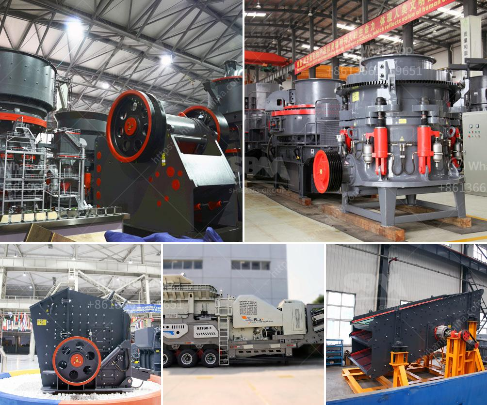

<h3>small scale aggregate crushing machine</h3>
Small scale aggregate crushing machine is widely used in mining, quarrying, construction sites, and recycling applications. Many different types of crushing equipment are used in these operations, such as jaw crushers, impact crushers, cone crushers and mobile crushers. These small scale crushing machines are designed in a compact and simple structure, making them convenient to transport and install. They can be used for small scale aggregate production and large scale aggregate production.

One of the main benefits of using small scale aggregate crushing machines is their portability factor. These machines can be easily transported to remote areas and set up where needed. This is especially beneficial for smaller construction companies or contractors who need to move their equipment frequently to different job sites. Additionally, the compact structure of these machines allows for easy installation, reducing the time and effort required for setup.

Small scale aggregate crushing machines are also ideal for small scale businesses or individuals who require a smaller amount of crushing capacity. These machines are not only cost-effective but also easy to operate and maintain. They can handle various types of materials, including concrete, asphalt, and rocks. This versatility makes them highly efficient in multiple applications.

Furthermore, small scale aggregate crushing machines are eco-friendly and environmentally conscious. They are designed to reduce waste and pollution associated with traditional crushing methods. These machines are equipped with advanced technology that minimizes dust and noise emission during operation. This ensures a safe working environment for operators and nearby residents.

When it comes to performance, small scale aggregate crushing machines deliver exceptional results. They are designed to produce consistent and high-quality aggregates, meeting the required specifications. This is essential for construction projects, where the quality of aggregates directly affects the strength and durability of the final product. Small scale crushing machines achieve this through multiple crushing stages, which ensure proper reduction and sizing of the aggregates.

In conclusion, small scale aggregate crushing machines offer numerous benefits for various industries. Their portability, compact structure, and ease of installation make them suitable for construction companies, contractors, and individuals who require crushing equipment for small scale projects. These machines are cost-effective, efficient, and environmentally friendly. They deliver consistent and high-quality aggregates, ensuring the success of construction projects. Whether used for mining, quarrying, construction, or recycling, small scale aggregate crushing machines are an essential tool for achieving efficient and sustainable operations.
<h3>Contact us</h3><ul><li><strong>Whatsapp:&nbsp;<a href="https://wa.me/8613661969651">+8613661969651</a></strong></li><li><a href="https://swt.shibang-china.com/?git&amp;zhl&amp;small scale aggregate crushing machine"><strong>Online Service(chat now)</strong></a></li></ul><h3>Related</h3><ul><li><a href='runner crusher china price.md'>runner crusher china price</a></li><li><a href='gold ore milling machine.md'>gold ore milling machine</a></li><li><a href='stone crushing machine price.md'>stone crushing machine price</a></li><li><a href='ball mill capacity 100 tph in gujarat.md'>ball mill capacity 100 tph in gujarat</a></li><li><a href='quartz ball mill.md'>quartz ball mill</a></li></ul>