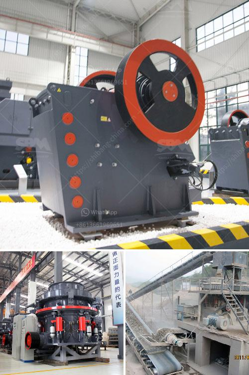

<h3>small scale coal processing plant</h3>
Coal plays a crucial role in powering homes, industries, and supporting economic growth in many countries around the world. While large-scale coal processing plants are common and well-established, small-scale coal processing remains a niche sector that presents immense opportunities for entrepreneurs.

A small-scale coal processing plant meets the growing demand for coal from various industries, such as manufacturing, construction, and power generation. Such a plant typically processes coal on a smaller scale, with a reduced capacity compared to its larger counterparts.

Starting a small-scale coal processing plant requires careful planning, research, and access to the necessary resources. However, the advantages it offers make it a viable business opportunity for both experienced coal industry professionals and newcomers looking to enter the sector.

One significant advantage of small-scale coal processing plants is their lower initial investment compared to large-scale facilities. With a smaller capacity, entrepreneurs can start small and expand gradually as their business grows. This allows for better risk management and a lower financial burden during the initial stages.

Moreover, a small-scale coal processing plant offers flexibility in terms of location. These plants can be established closer to the coal source, reducing transportation costs and ensuring a steady and reliable supply of raw material. This proximity to the source also enables entrepreneurs to exercise better control over the quality and specifications of the processed coal.

In addition to the financial benefits, small-scale coal processing plants contribute to local development. They create employment opportunities, supporting the livelihoods of people living in the surrounding communities. These plants also help stimulate local economies by fostering demand for local fuel and transportation services.

It is important to note that small-scale coal processing plants need to adhere to strict environmental regulations. These regulations ensure that the plant's operations are environmentally sustainable and minimize pollution and negative impacts on air, water, and soil quality. Entrepreneurs in this industry must be aware of the necessary permits, licenses, and environmental assessments required to operate within the legal framework.

Investing in modern and efficient equipment is also crucial for the success of a small-scale coal processing plant. Advanced technologies can help improve the plant's performance, enhance energy efficiency, and reduce emissions. Constant innovation and staying up-to-date with industry advancements are necessary to stay competitive in this sector.

To establish a strong customer base, entrepreneurs should build partnerships with industries and businesses that heavily rely on coal. These may include power plants, cement manufacturers, and steel production facilities. Ensuring a consistent and reliable supply of high-quality processed coal will help foster long-term relationships with these customers and secure a steady stream of revenue.

In conclusion, a small-scale coal processing plant presents an attractive business opportunity for entrepreneurs venturing into the coal industry. The lower initial investment, flexibility in location, and potential for local development make it a viable option. However, entrepreneurs must also be conscious of environmental regulations, invest in modern equipment, and establish strong relationships with key customers. With the right resources and strategic planning, a small-scale coal processing plant can thrive and contribute to the energy needs of various industries while creating positive impacts on the local community.
<h3>Contact us</h3><ul><li><strong>Whatsapp:&nbsp;<a href="https://wa.me/8613661969651">+8613661969651</a></strong></li><li><a href="https://swt.shibang-china.com/?git&amp;zhl&amp;small scale coal processing plant"><strong>Online Service(chat now)</strong></a></li></ul><h3>Related</h3><ul><li><a href='mining belt conveyor systems.md'>mining belt conveyor systems</a></li><li><a href='price of smallest ballast crusher in kenya.md'>price of smallest ballast crusher in kenya</a></li><li><a href='feldspar crusher supplier.md'>feldspar crusher supplier</a></li><li><a href='petitpierre 20tph rapport de projet.md'>petitpierre 20tph rapport de projet</a></li><li><a href='for sale used mobile jaw crusher philippines.md'>for sale used mobile jaw crusher philippines</a></li></ul>