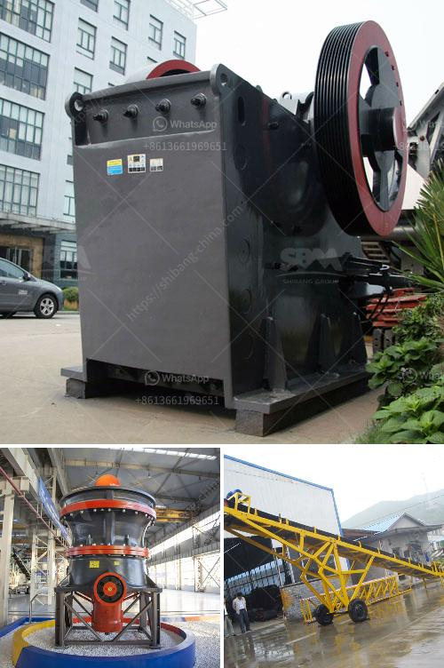

<h3>small scale gold cip processing</h3>
Gold mining is a crucial sector in many developing countries, providing employment and income to millions of people. However, it also poses significant environmental and social challenges. Artisanal and small-scale miners (ASM) often use inefficient and harmful methods to extract gold, resulting in pollution, deforestation, and health hazards.

To address these issues, the concept of small-scale gold CIP (carbon in pulp) processing has emerged as a sustainable solution. CIP processing involves the absorption of gold from ore using carbon as a medium. This method is efficient, cost-effective, and environmentally friendly, making it suitable for small-scale mining operations.

One of the significant advantages of small-scale gold CIP processing is its ability to recover substantially more gold from low-grade ore compared to traditional methods such as mercury amalgamation. Amalgamation, which involves using mercury to extract gold, is highly poisonous and poses severe health risks to miners and the surrounding communities. CIP processing avoids the use of mercury altogether, protecting both miners and the environment.

Another key benefit of CIP processing is its ability to minimize the release of pollutants into the environment. In traditional gold extraction methods, the ore is often crushed and mixed with harmful chemicals such as cyanide, which poses significant risks to aquatic life and nearby communities. CIP processing, on the other hand, utilizes carbon as an adsorbent for gold, eliminating the need for harmful chemicals. This not only reduces pollution but also minimizes the chances of accidental spills or leaks.

Moreover, small-scale gold CIP processing promotes responsible and sustainable mining practices. It encourages miners to adopt formalized mining structures, prioritize worker safety, and improve waste management practices. By implementing CIP processing, ASM can enhance their operations' efficiency, productivity, and profitability while minimizing negative social and environmental impacts.

Implementing small-scale gold CIP processing does have its challenges, particularly for resource-constrained miners. The initial investment in equipment and infrastructure can be daunting for some, as CIP processing requires specialized technology and expertise. Additionally, proper training and education on the use of CIP processing are necessary to ensure its effective implementation. Governments, organizations, and stakeholders must collaborate to provide support, training, and financing options to promote the adoption of small-scale gold CIP processing.

In conclusion, small-scale gold CIP processing presents a sustainable solution for artisanal and small-scale miners. It offers a safer and more environmentally friendly alternative to harmful extraction methods such as mercury amalgamation. By leveraging carbon as an adsorbent, CIP processing enables the recovery of more gold from low-grade ore while minimizing pollution and ensuring responsible mining practices. The adoption of small-scale gold CIP processing could transform the gold mining sector, promote economic development, and protect the environment for future generations.
<h3>Contact us</h3><ul><li><strong>Whatsapp:&nbsp;<a href="https://wa.me/8613661969651">+8613661969651</a></strong></li><li><a href="https://swt.shibang-china.com/?git&amp;zhl&amp;small scale gold cip processing"><strong>Online Service(chat now)</strong></a></li></ul><h3>Related</h3><ul><li><a href='roller mill calcium.md'>roller mill calcium</a></li><li><a href='mining belt conveyor systems.md'>mining belt conveyor systems</a></li><li><a href='small portable swing jaw crushers.md'>small portable swing jaw crushers</a></li><li><a href='ball mill pulverizer price.md'>ball mill pulverizer price</a></li><li><a href='stone crusher quarry.md'>stone crusher quarry</a></li></ul>