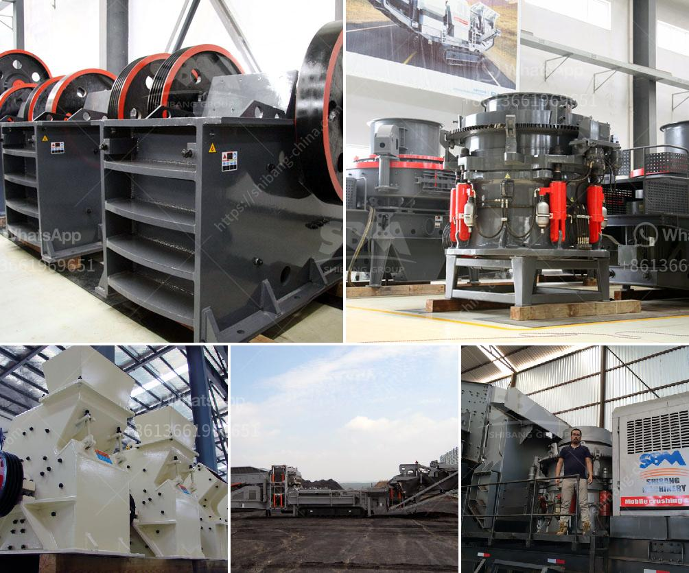

<h3>small scale gold mill from china</h3>
Gold mining has been an essential part of human history, providing societies with valuable mineral resources to create wealth and flourish. The rise of small-scale gold mills from China has brought new opportunities for communities looking to tap into this lucrative industry. With remarkable technological advancements and cost-effective operations, these mills have become a promising venture for miners seeking sustainable profits. This article sheds light on the benefits associated with small-scale gold mills from China that have revolutionized the industry and empowered local communities.

One of the distinguishing characteristics of small-scale gold mills from China is their state-of-the-art technology and equipment. These mills employ innovative machinery that enables efficient gold extraction from ore, minimizing waste and enhancing productivity. With the help of advanced crushing, grinding, and amalgamation techniques, China's small-scale gold mills have streamlined operations and increased extraction rates.

Another compelling aspect of small-scale gold mills from China is their cost-effectiveness. Traditional gold mining methods involve labor-intensive processes and often require significant investments. However, these Chinese mills have introduced modern techniques that reduce both labor and capital costs.

Automation plays a vital role in improving cost-effectiveness as it lowers the dependency on manual labor, thus minimizing wages and increasing productivity. The adoption of cutting-edge machinery and equipment also minimizes energy consumption, leading to further cost savings.

Furthermore, small-scale gold mills from China benefit from economies of scale due to the vast mining industry within the country. The availability of local suppliers reduces transportation costs for machinery and key inputs required in the extraction process. This advantage allows miners to maximize their profitability by reducing operational costs.

The advent of small-scale gold mills from China has had a profound impact on local communities. By embracing modern technologies and sustainable practices, these mills prioritize environmental protection and social responsibility. They strive to minimize the ecological footprint through responsible waste management and support initiatives that ensure the well-being of surrounding communities.

Moreover, small-scale gold mills from China generate employment opportunities for local residents. Miners, technicians, and support staff are hired from nearby areas, stimulating economic growth and contributing to regional development. The steady income generated from gold mining injects funds into local businesses, services, and infrastructure, lifting communities out of poverty and helping them achieve a higher standard of living.

The rise of small-scale gold mills from China has transformed the gold mining industry, offering immense opportunities for miners worldwide. The integration of cutting-edge technology, cost-effective operations, and commitment to sustainability has accelerated the growth of this sector. These mills have brought not only financial rewards but also lasting benefits to local communities through employment opportunities and regional development.

However, it is essential to emphasize that the growth of this industry should be accompanied by stringent regulations and monitoring to prevent any adverse environmental impacts. Striking a delicate balance between economic prosperity and environmental preservation is crucial to ensure the sustainable and responsible growth of the small-scale gold mill industry from China.
<h3>Contact us</h3><ul><li><strong>Whatsapp:&nbsp;<a href="https://wa.me/8613661969651">+8613661969651</a></strong></li><li><a href="https://swt.shibang-china.com/?git&amp;zhl&amp;small scale gold mill from china"><strong>Online Service(chat now)</strong></a></li></ul><h3>Related</h3><ul><li><a href='stone quarry equipment germany.md'>stone quarry equipment germany</a></li><li><a href='types of crusher for ore processing.md'>types of crusher for ore processing</a></li><li><a href='limestone crisher machine for sale in cebu.md'>limestone crisher machine for sale in cebu</a></li><li><a href='ball mill for size reduct.md'>ball mill for size reduct</a></li><li><a href='iron ore mines buyers in india.md'>iron ore mines buyers in india</a></li></ul>