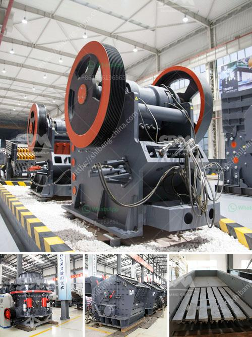

<h3>small scale gold mining machine and their price</h3>
Gold mining is an essential activity in many countries, especially those with abundant mineral resources. The gold ore is extracted from deposits in the earth's crust using various techniques such as underground mining and open-pit mining. To efficiently extract gold, the use of specialized machines is imperative.

Small scale gold mining machines play a crucial role in the mining industry. These machines collect the mineralized ore and extract the desired metals such as gold. These machines are affordable and easily accessible to small scale miners who lack the capital to invest in machinery at a larger scale. The versatility and efficiency of these machines have made them essential in the gold mining process.

One popular small scale gold mining machine is the Knelson Centrifugal Concentrator. It is a centrifugal gravity concentrator that performs the recovery of free gold particles. The machine uses centrifugal force to separate gold from the surrounding debris, allowing for efficient gold extraction. Prices for these machines range from $7,000 to $10,000, making them accessible for small scale miners.

Another commonly used machine is the shaking table. This table utilizes gravity and the oscillating motion to separate gold particles from the ore. Prices for shaking tables can range from $2,000 to $5,000, depending on the size and capacity.

Additionally, small scale gold mining machines such as trommels, vibratory wash plants, and dredges are also commonly used. Prices for these machines can vary greatly depending on the size and capacity. These machines are designed to efficiently process large volumes of material, improving the overall gold recovery process.

It is important to note that the prices mentioned are rough estimates and can vary depending on factors such as the country of purchase, current market demand, and extra features of the machines.

In conclusion, small scale gold mining machines are vital for the efficient extraction of gold. These machines allow small scale miners to process larger volumes of material at an affordable price. While the cost of these machines may vary, they provide significant value in improving gold recovery rates. For small scale miners, investing in these machines is crucial for their long-term success in the gold mining industry.
<h3>Contact us</h3><ul><li><strong>Whatsapp:&nbsp;<a href="https://wa.me/8613661969651">+8613661969651</a></strong></li><li><a href="https://swt.shibang-china.com/?git&amp;zhl&amp;small scale gold mining machine and their price"><strong>Online Service(chat now)</strong></a></li></ul><h3>Related</h3><ul><li><a href='30t hr 50t hr range stone crusher plant china.md'>30t hr 50t hr range stone crusher plant china</a></li><li><a href='used chrome ore mining crushing equipment crusher.md'>used chrome ore mining crushing equipment crusher</a></li><li><a href='barite mining and quarry equipment spain.md'>barite mining and quarry equipment spain</a></li><li><a href='production of cement mill in algerie.md'>production of cement mill in algerie</a></li><li><a href='mill grinder for sale.md'>mill grinder for sale</a></li></ul>