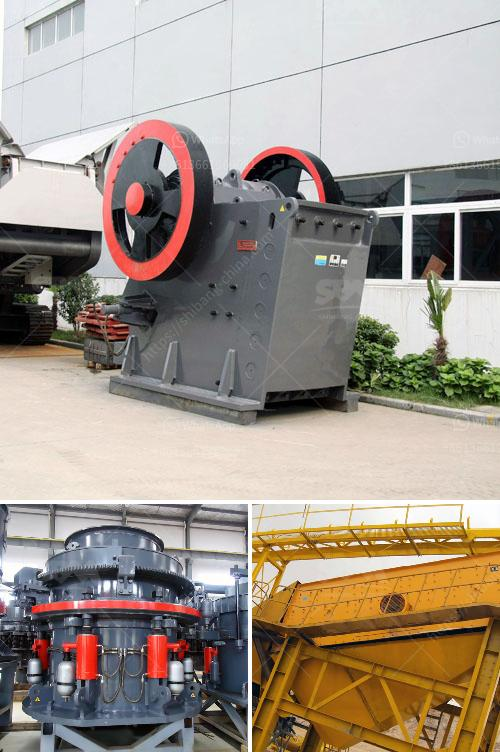

<h3>small scale iron ore processing plants sale</h3>
Iron ore is one of the most sought-after metals in the world. It is used in various industries, including construction, manufacturing, automotive, and more. With the increasing demand for iron ore, many communities are considering setting up small-scale iron ore processing plants to meet their local needs and contribute to the local economy.

Small-scale iron ore processing plants can be a great option for entrepreneurs or communities looking to start a profitable business in the mining sector. These plants are designed to process up to a few hundred tons of iron ore per day and can be scaled up or down depending on the ore deposits and operational requirements.

Setting up a small-scale iron ore processing plant requires relatively low initial investment and can be done with simple equipment and machinery. The process involves crushing the ore into smaller pieces, followed by screening the crushed ore to remove any impurities. The iron ore is then further processed to separate the iron from other minerals or impurities, using magnetic separation techniques.

The sale of small-scale iron ore processing plants is a significant boost to the local economy. These plants generate jobs and income for the surrounding community, reduce transportation costs, and promote local mining activities. Additionally, by processing iron ore locally, communities can retain more value from their natural resources and avoid depending on imports.

The establishment of small-scale iron ore processing plants can also help tackle environmental concerns. In large-scale mining operations, extensive excavation and transportation of ore contribute to deforestation, soil erosion, and pollution. By processing the iron ore locally, smaller plants can reduce the environmental footprint associated with such activities.

In addition to the economic and environmental benefits, small-scale iron ore processing plants can support the development of local skills and expertise. As the industry grows, individuals in the community can gain experience in various aspects of mining, including geology, engineering, and management. This can lead to the development of a skilled workforce that can contribute to the growth of other mining-related industries in the region.

To ensure the success of small-scale iron ore processing plants, governments and local authorities can provide support through infrastructure development, access to financing, and regulatory frameworks. Additionally, partnerships with established mining companies or industry experts can offer technical know-how and guidance to new entrants.

While setting up and operating small-scale iron ore processing plants may have its challenges, the potential benefits for the local community and economy are immense. Communities with significant iron ore resources should explore the feasibility of establishing such plants and harness the potential of this valuable mineral.

In conclusion, small-scale iron ore processing plants can be a game-changer for local communities. They offer opportunities for job creation, economic growth, environmental responsibility, and the development of local skills. Governments, industry experts, and communities should work together to support and promote the establishment of these plants for the benefit of all stakeholders involved.
<h3>Contact us</h3><ul><li><strong>Whatsapp:&nbsp;<a href="https://wa.me/8613661969651">+8613661969651</a></strong></li><li><a href="https://swt.shibang-china.com/?git&amp;zhl&amp;small scale iron ore processing plants sale"><strong>Online Service(chat now)</strong></a></li></ul><h3>Related</h3><ul><li><a href='stone crusher machine 100 cm.md'>stone crusher machine 100 cm</a></li><li><a href='crushing plant suppliers in pakistan.md'>crushing plant suppliers in pakistan</a></li><li><a href='crushing machine in quarry.md'>crushing machine in quarry</a></li><li><a href='high crushing ratio low cost jaw crusher machine.md'>high crushing ratio low cost jaw crusher machine</a></li><li><a href='gypsum calcination processing plant equipments.md'>gypsum calcination processing plant equipments</a></li></ul>