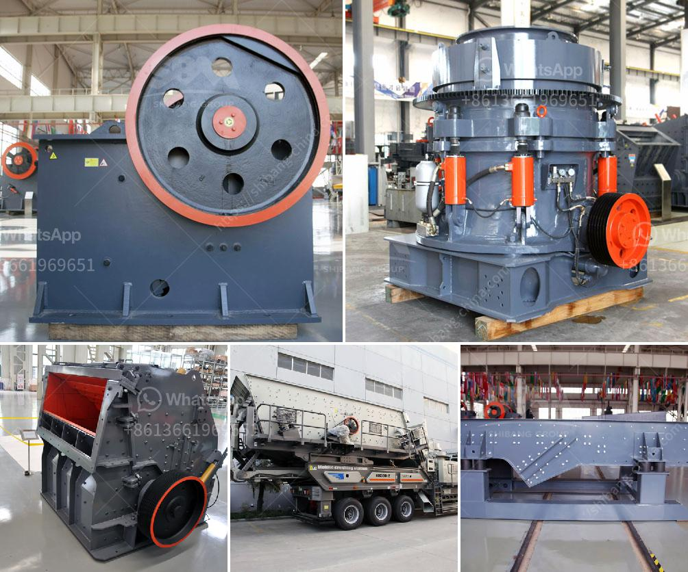

<h3>small scale tin mining design</h3>
Tin mining has been an important industry for centuries, providing valuable tin ore that is used in various applications, including electronics, construction, and automotive. While large-scale tin mining operations are well-established and heavily regulated, small-scale tin mining presents unique challenges and opportunities.

Small-scale tin mining is often carried out by individuals or small groups using rudimentary tools and techniques. While their operations may not match the scale of large mining companies, they contribute significantly to the overall tin production. However, the lack of proper infrastructure and sustainable practices can result in environmental degradation and safety hazards.

Efficient and sustainable small-scale tin mining design is crucial to address these issues and ensure responsible mining practices. Here, we discuss key considerations for designing a small-scale tin mining operation that balances efficiency and sustainability.

1. Mapping and Prospecting: A comprehensive understanding of the mining area is essential before starting any operation. Conduct geological surveys and mapping exercises to identify potential tin-rich areas and determine the economic viability for small-scale extraction.

2. Equipment and Technology: The choice of equipment and technology is critical to ensure efficiency and productivity. Select tools that are appropriate for small-scale operations, such as slushers, jigs, and hand-held detectors. Training miners in handling and maintenance of equipment can help optimize performance while minimizing downtime.

3. Safety Measures: Establish safety protocols and provide appropriate protective gear to reduce accidents and health risks associated with small-scale tin mining. Invest in training programs for miners to ensure they are well-equipped to handle potential hazards like landslides or collapsing tunnels.

4. Environmental Protection: Implement sustainable practices that minimize the environmental impact of small-scale tin mining. Proper waste management, including tailings storage facilities and water treatment, is crucial. Adopting responsible mining practices, such as reclamation of mined areas, can help restore the environment.

5. Support and Regulations: Governments and relevant stakeholders need to provide support and regulations to foster responsible small-scale tin mining. Develop initiatives that promote access to credit, market linkages, and technical assistance for small-scale miners. Encourage the formation of cooperatives or partnerships that allow miners to pool resources and share expertise.

6. Community Engagement: Engage with local communities to ensure that small-scale tin mining benefits them economically and socially. Establish dialogue and partnerships with local residents to address their concerns and involve them in decision-making processes. Implement social development projects that contribute to the overall well-being of the community.

7. Market Access: Small-scale miners often face challenges in accessing the market due to lack of resources and infrastructure. Facilitate market linkages by creating platforms where buyers and miners can directly interact. Support value addition activities that enable small-scale miners to process raw tin into higher-value products, enhancing their profitability.

Small-scale tin mining design should prioritize the well-being of miners, environmental stewardship, and socioeconomic development of local communities. Partnership and collaboration among governments, mining associations, and small-scale miners are crucial to establish a regulatory framework that balances efficiency and sustainability.

By incorporating these considerations into the design and operation of small-scale tin mining, we can ensure the long-term viability of this vital industry while minimizing its negative impact. Ultimately, responsible small-scale tin mining can contribute to economic growth, sustainable development, and a greener future.
<h3>Contact us</h3><ul><li><strong>Whatsapp:&nbsp;<a href="https://wa.me/8613661969651">+8613661969651</a></strong></li><li><a href="https://swt.shibang-china.com/?git&amp;zhl&amp;small scale tin mining design"><strong>Online Service(chat now)</strong></a></li></ul><h3>Related</h3><ul><li><a href='ore crushers benoni.md'>ore crushers benoni</a></li><li><a href='best cone crusher.md'>best cone crusher</a></li><li><a href='used pioneer jaw crusher.md'>used pioneer jaw crusher</a></li><li><a href='quartz plant manufacturing process.md'>quartz plant manufacturing process</a></li><li><a href='how much is a stone crusher.md'>how much is a stone crusher</a></li></ul>