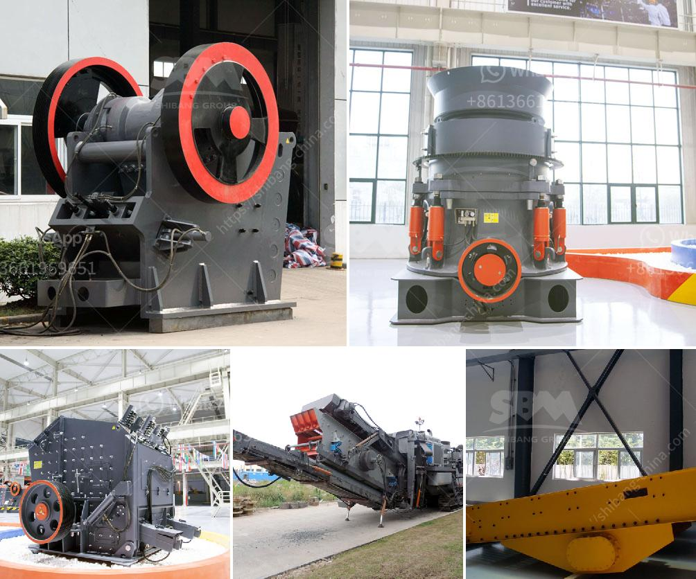

<h3>small scale verticle grinding limestone machine</h3>
Small scale vertical grinding limestone machine, also called limestone mills, is an advanced limestone grinding mill equipment developed by Guilin Hongcheng in combination with the actual production needs of limestone powder processing industry. The equipment can provide users with a set of limestone grinding production line equipment of various industrial scales. Low investment, high efficiency, environmental protection and energy saving make it an ideal choice for limestone grinding.

Limestone is a common non-metallic mineral. With the development of modern science and technology, limestone has been widely used in various fields of daily life and industry. With the improvement of people's living standards, the requirements for the fineness and quality of limestone powder are getting higher and higher. Traditional limestone grinding equipment, such as Raymond mills and ball mills, are difficult to meet the requirements of large-scale production. After years of exploration, Hongcheng has developed a series of small-scale vertical grinding limestone machines that are more suitable for small and medium-sized enterprises.

Small scale vertical grinding limestone machine has a small footprint and low overall investment. Its design structure is compact, which effectively reduces the floor space for installation. At the same time, the equipment's production capacity and efficiency are not compromised. It can meet the production needs of 20-400 mesh limestone powder. The equipment integrates crushing, grinding, grading, and powder collection, which greatly improves the grinding efficiency and output, and reduces energy consumption.

The vertical grinding limestone machine of Hongcheng adopts advanced grinding roller device and grinding ring design, which can effectively improve the grinding efficiency and reduce the wear rate of vulnerable parts. The grinding roller and grinding ring are made of special wear-resistant steel, which is not easy to break, ensuring the long-term operation of the equipment.

In addition, small scale vertical grinding limestone machine is equipped with a dust collection system to effectively reduce dust pollution, which meets the requirements of environmental protection. The system uses advanced pulse dust collector and muffler technology. The dust removal efficiency is as high as 99%, which effectively guarantees the cleanliness of the production environment and avoids secondary pollution.

In summary, small scale vertical grinding limestone machine has many advantages such as small investment, high efficiency, environmental protection, and energy saving. It is ideal equipment for limestone grinding. Whether it is used in small-scale production or as a supporting equipment for large-scale production, the equipment can effectively improve the quality of limestone powder and create greater economic value. With its excellent performance and competitive price, Hongcheng's small-scale vertical grinding limestone machine has won the favor and trust of customers in the market.
<h3>Contact us</h3><ul><li><strong>Whatsapp:&nbsp;<a href="https://wa.me/8613661969651">+8613661969651</a></strong></li><li><a href="https://swt.shibang-china.com/?git&amp;zhl&amp;small scale verticle grinding limestone machine"><strong>Online Service(chat now)</strong></a></li></ul><h3>Related</h3><ul><li><a href='tons per hour ball mill for sale in south africa.md'>tons per hour ball mill for sale in south africa</a></li><li><a href='calcium carbonate powder making.md'>calcium carbonate powder making</a></li><li><a href='coal mining machine undercuter.md'>coal mining machine undercuter</a></li><li><a href='mobile crushing unit.md'>mobile crushing unit</a></li><li><a href='stone crusher mobile plant di indonesia.md'>stone crusher mobile plant di indonesia</a></li></ul>