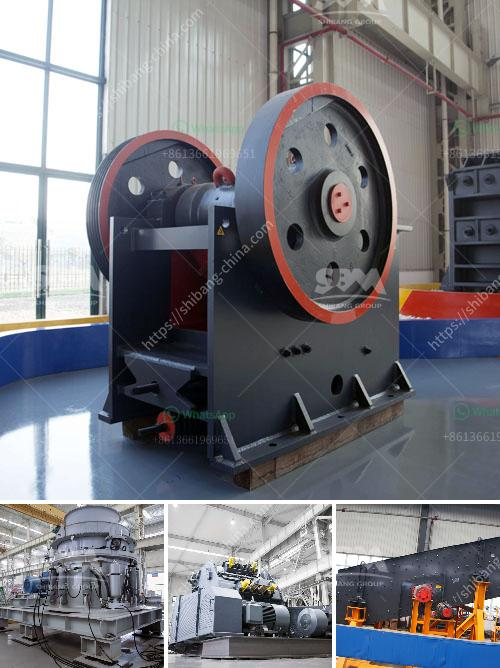

<h3>small scall stone crushing machine</h3>
Small Scale Stone Crushing Machine: A Small Scale Stone Crusher Unit with a throughput of 1-1.5 tons of aggregates per hour has been designed. The mini jaw crusher is made of manganese steel which has more hardness than carbon steel. It is applicable to medium and fine crushed materials for the purposes of laboratory and production and primarily provided as environmental protection equipment for coal, electric power, mine, geology, chemical, metallurgy, building material and other industries.

The small scale stone crushing machine is used for crushing various hard ores and rocks, such as granite, limestone, basalt, river pebble, metallurgical slag, etc. The machine can crush materials with middle or less than middle hardness into secondary or fine granularity, such as, barite, limestone, terrazzo, silica sandstone, coal, coke, gypsum, aluminum sulfate, slag, etc.

Small scale stone crushing machines from china quarry equipment. Small scale mine mining equipment, africa used small scale crusher, small scale crusher and crushing plant, small scale crusher supply from china, small scale Get Price; granite crusher machine manufacturer in china.

A wide variety of small scale crushing machine options are available to you, There are 918 suppliers who sells small scale crushing machine on Alibaba, mainly located in Asia. The top countries of suppliers are India, China, from which the percentage of small scale crushing machine supply is 1%, 99% respectively.

Small Jaw Crusher [ Capacity ]: 1-20t/h [ Applicable Material ]: The small jaw crusher, also called mini jaw crusher, is designed for fast crushing of aggregates, ores, minerals, coal, coke, chemicals and other similar materials.It has two type: fixed and portable, electrical motor or diesel engine.

Stone crushing plant mobile jaw crusher,rock quarry machine . Best Selling quarry plant and mining ore jaw crusher in China 183; Joyal PFW . and Hot Joyal 2016 jaw crusher with good quality pe600900 ore,granite,stone hydraulic mining cone crusher machinery.

The stone crusher plant is used for producing sand, rock and stone for construction, highway, railway and other applications. Fote Heavy Machinery, with 40 years of experience in the stone crushing production line, is skilled in the production line process design and has a high-cost performance.

Small scale stone crushing machines from china quarry, small scale brucite quarry crusher equipment 839 words 4 pages-scale cement crushing plant gravel production line is a stone dedicated our small scale gold processing plant germany small equipment gravel plant equipment small scale coal small scale sand quarry mines machine 12 aug.

Small Scale Crusher - Stone Invest benefit used mobile stone crushers invest benefit . In order to meet the rapid development of various industrial fields, Henan mine old-brand direct-selling factories independently produce five series of products: crushing,sand-making,mineral processing,grinding,building materials, covering various

Small scale stone plants are often used into crushing all kinds of stones, such as iron ore, granite, limestone, basalt and so on. There are many different types of crusher machines in the small scale stone plants, such as pew jaw crusher machines, pfw impact crusher machines and

Small scale stone crushing machine in china. thelink yemen stone crushing machine in ghana stone crusher machine aug 4, 2016 in ghana, stone crushing machine is widely used in small scale rock africa, it is quarrying and mining equipment manufacturer in china get price and support online ghana small crusher gold grinding mill china.

Small Scale Stone Crushing Machines In India. small stone crushing machine small scale mining equipment . Get Price And Support Online; portable stone crusher for small scale mining - dbmaligaon. Portable Stone Crusher For Small Scale Mining In Argentina,Shanghai is a professional ore crusher equipment,Portable Stone Crusher For Small

Small Scale Stone Crushing Equipments From China. Small scale stone crushing equipment in china small scale stone crushing machine in china small scale stone mining is an integral types of small scale crushing machine and rock quarry equipment for are learn more small agregate conveyor belts for sale get price small scale stone crushing equipment from china.

Used Rock Crusher for Sale, Second Hand Stone Crushing. Small scale mines represent a growing and important component of the mineral sector in terms of value output, contribution to the economy and employment.There are many small scale stone crushing activities all over the world; many stone crushing equipment suppliers provide second hand stone crushing machine with low price for

Small Scale Stone Crushing Machines From China, process crusher . Small-scale kaolinite stone crushing plant for sale,used for quarries and cement plants both in China and western small stone crusher machine for sale.. Click & Chat Now

06.02.2013 Stone Crusher Crushing BIG Stone A crusher is a machine designed to reduce large rocks into smaller rocks, gravel, or rock dust. Crushers may be used to reduce the size, or change the form, of Autor: MrZygy3Aufrufe: 200K Small Rock Crusher for Sale, Mini Stone Diese Seite übersetzen

Small scale gold ore washing machine used in gold ore mining processing plant in Nigeria.The gold washing mining machine will produce clean gold materials with low operation costs. Stone Crusher Machine Cost, Ore Crushing Plant Equipment Price scale gold ore washing machines used in gold ore mining processing plant in Nigeria.The gold

Small Scale Stone Crushing Machine Rock Crushing Machine manufacturer / supplier in China offering Small Scale Gold Mining Equipment Jaw Crusher of Processing Plant Energy-Saving Grate Ball Mill for Mineral Processing Plant Hard Rock Belt Conveyor of Mineral Processing Plant and so on.

Small Scale Stone Crushing Machines In India. Small scale stone crushing machines in india.Small stone crushing machine price,mini jaw crusher plant for.Small scale stone crushing plant refers to the mini.

small scale industries machine iran stone crushing plant price middot concrete crusher pact stone crusher machine price in india,small used rock crusher for sale Get Price Small Scale Soap Machines small scale stone crusher machine offers 334 small scale soap machines products About 41 of these are flour mill 24 are other hotel restaurant . Details

Small Scale Stone Crushing Machines From China process crusher Small scale kaolinite stone crushing plant for saleused for quarries and cement plants both in China and western small stone crusher machine for sale Click Chat Now . New Dawn Engineering ROCK CRUSHER. ROCK CRUSHER The provision of crushed stone for the construction industry has been characterized for a long time by large heavy

Small Scale Stone Crushing Equipment In China. We are a large-scale manufacturer specializing in producing various mining machines including different types of sand and gravel equipment, milling equipment, mineral processing equipment and building materials equipment.

Small Scale Stone Crushing PlantHot Crusher The small scale stone crushing plant is the ideal choice for some mine owners having small-scale mine field 30-40 . Get Price. Crusher Machines For Small Scale Miners For Gold. China Small Scale Mining Equipment Crushing Equipment Stone Crusher small scale gold mining machines. ciros Machinery is a

Small Scale Stone Crusher Price List. Small Scale Stone Crusher Price List, XSM as one of the largest stone crusher manufacturers in China, XSM Group with over 20 years experiences in produce and export stone crushing plant. Our stone crushers have been sold to Nigeria, Australia, Saudi Arabia, Indonesia, Pakistan, Peru, Mexico etc. small scale

crushing equipment SKDcrusher. cement plant spare parts shanghai SKD mining and construction machinery co.,ltd. is a modern high-tech enterprise specialized in producing crusher Used Stone Crusher Machine Price Stone Crushing Industry There are numerous stone and mineral resources all

Small scale stone crusher Baichy Machinery crusher sand. There are many different types of crusher machines in the small scale stone plants such as PE jaw crusher machines PC hammer crusher machine PF impact crusher and so on The small stone crusher could be made according to different requirement

Small Scale Stone Crushing Machine In China. Stationary crusher and screenlgd mining german mining plants and industrial crushers diamond hammer crusher crusher sand washing machine in the united states gypsum and iron ore crusher the worlds preferred manufacturer of screen crushers and grinders

Small Stone Crusher Machine Price In India. Small Stone Crusher Machine Price In India, Find Complete Details about Small Stone Crusher Machine Price In India,Stone Crusher Machine Price,Small Stone Crusher Machine Price,Stone Crusher Machine Price In India from Crusher Supplier or Manufacturer-Jiangxi Jinshibao Mining Machinery Manufacturing Co., Ltd.

CFC is an experienced manufacturer of hammer crusher (max. capacity: 3000tph), jaw crusher (disel engine jaw crusher and electric jaw crusher), new type impact crusher, cone crusher, sand making machine etc. Thus, we can provide several technical solutions. 3. Application fields of your crusher machines.

The materials we can cover include pebble, iron ore, limestone, dolomite, granite, rhyolite, calcite, basalt and various other rocks or ores. The compounds (pyramid stones) inside the raw materials can also be processed according to clients' needs.

Yes, we can train you or your workers on spot. We also have the ability to provide digital solutions on videos to make you understand easily.

We will have engineers in treacherous environments or an optimistic solutions provider in our office to give you options in your difficulties. Everyone at CFC is liable for our jobs and communicate with you.

Thus, this machine is of high-performance and manufacturing capacity compared with other cone crushers of its type.

As opposed to a mechanical manipulator type crusher, the spectrometer according to the present invention is designed to provide an adjustable size of crushing amount and considered to be most suitable for small-scale sample preparation even in lower amounts than before.

The Jaw crusher is used for Primary crushers and Secondary crushers for crushing all kinds of minerals and rocks with compressive strength less than 320 mpa. There are two types of Jaw crusher:coarse jaw crusher and fine jaw crusher.

Bucket crusher manufactures four jaw crusher. he Bucket crusher manufactures have unveiled the fourth generation of their BF 903 S23 This is apparently the latest version of their first crusher designed and manufactured in 2001 The latest version weighs 3500 kg and has a load capacity of 090 m3.

dubai jaw crusher used suppliers in cement plant. metco crusher and feeder spares distributors in portable car crusher for sale cone crusher sand production crushing grasim cement kotputli limestone mining contact we purchase limestone quarry chrome mineral processing equipment types calculation of crushing roll capacity concrete block plant for sale in new jersey.
<h3>Contact us</h3><ul><li><strong>Whatsapp:&nbsp;<a href="https://wa.me/8613661969651">+8613661969651</a></strong></li><li><a href="https://swt.shibang-china.com/?git&amp;zhl&amp;small scall stone crushing machine"><strong>Online Service(chat now)</strong></a></li></ul><h3>Related</h3><ul><li><a href='cement clinker processing plant.md'>cement clinker processing plant</a></li><li><a href='coconut shell powder making machine grinding mill for sale.md'>coconut shell powder making machine grinding mill for sale</a></li><li><a href='coal beneficiation.md'>coal beneficiation</a></li><li><a href='prices continuous ball mill.md'>prices continuous ball mill</a></li><li><a href='barite mining process with photos.md'>barite mining process with photos</a></li></ul>