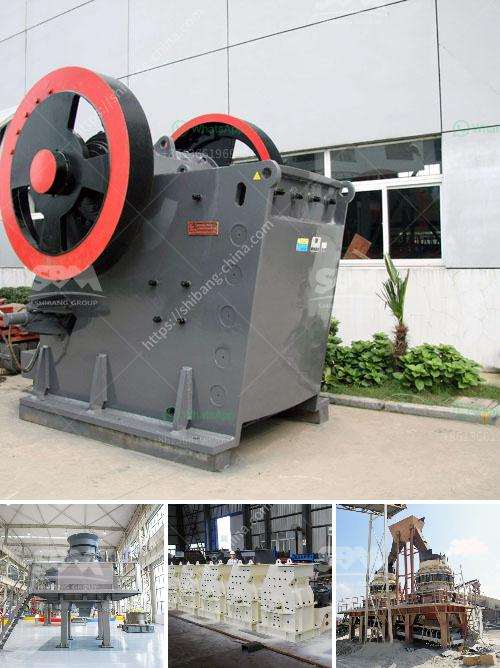

<h3>small slag crushing plant manufacturers in delhi</h3>
Slag, a byproduct of steel production, is a commonly used material in construction and infrastructure projects. However, disposing of slag can be an expensive and challenging task. To address this issue, small slag crushing plant manufacturers in Delhi have emerged to provide efficient and cost-effective solutions for processing slag.

These small-scale manufacturers specialize in designing and manufacturing crushing plants specifically for slag. They use state-of-the-art technology and innovative processes to ensure efficient and environmentally-friendly slag processing. These plants are designed to effectively crush and separate slag into reusable materials, minimizing waste and reducing the environmental impact of slag disposal.

One of the key advantages of small slag crushing plant manufacturers is their ability to customize the design and size of the plants according to the specific requirements of their clients. They understand that each project has unique demands, and therefore offer tailor-made solutions to ensure maximum efficiency and productivity.

In addition to their flexibility, small slag crushing plant manufacturers in Delhi also focus on affordability. They aim to provide cost-effective solutions that cater to the needs of small to medium-sized businesses or contractors with limited budgets. By offering competitive prices without compromising on quality, these manufacturers have become a preferred choice for many.

Furthermore, these manufacturers prioritize quality and reliability. They use high-quality materials and components to ensure their crushing plants can withstand the harsh conditions of slag processing. By offering durable and reliable equipment, they help their clients minimize downtime and maximize productivity.

To conclude, small slag crushing plant manufacturers in Delhi are playing a critical role in addressing the challenges associated with slag disposal. Their specialized and customized solutions are not only efficient and cost-effective but also environmentally friendly. As the demand for sustainable construction practices grows, these manufacturers serve as valuable partners for businesses and contractors looking for innovative ways to handle slag.
<h3>Contact us</h3><ul><li><strong>Whatsapp:&nbsp;<a href="https://wa.me/8613661969651">+8613661969651</a></strong></li><li><a href="https://swt.shibang-china.com/?git&amp;zhl&amp;small slag crushing plant manufacturers in delhi"><strong>Online Service(chat now)</strong></a></li></ul><h3>Related</h3><ul><li><a href='small profile format for crusher company.md'>small profile format for crusher company</a></li><li><a href='portable jaw crusher.md'>portable jaw crusher</a></li><li><a href='iron processing machine in mexico.md'>iron processing machine in mexico</a></li><li><a href='chrome washing plant new technology.md'>chrome washing plant new technology</a></li><li><a href='stone crusher companies in pakistan.md'>stone crusher companies in pakistan</a></li></ul>