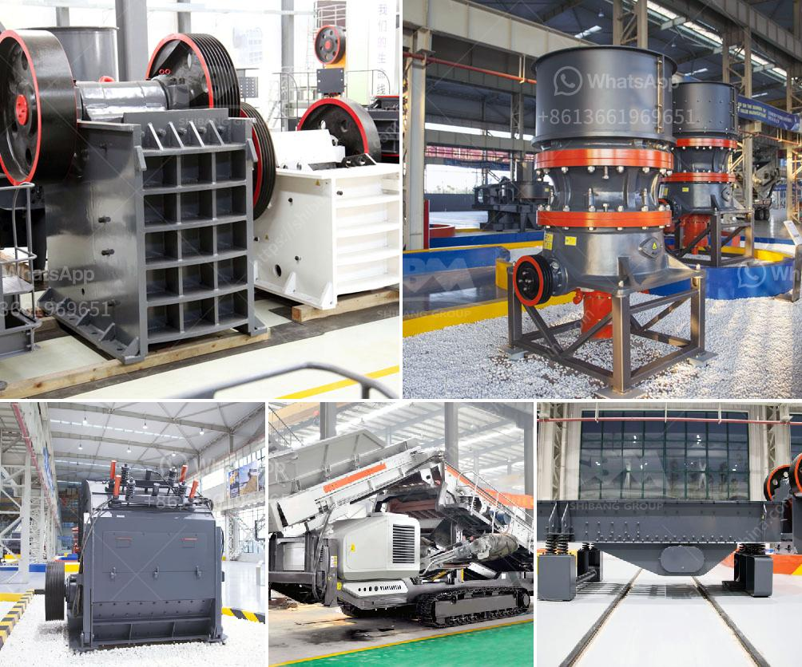

<h3>small stone crushers for sale</h3>
Stone crushing is the process of reducing large stones into smaller sized stones. These stones are used in various construction activities, such as buildings, highways, bridges, and canals, etc. There are different types of stone crushers available for sale, including jaw crushers, impact crushers, and cone crushers, among others.

However, when it comes to purchasing a stone crusher, it can be challenging, especially if you are on a tight budget. Fortunately, there are small stone crushers for sale that can meet your requirements without breaking the bank. These crushers are affordable, efficient, and provide effective crushing solutions for various applications.

One of the key advantages of buying small stone crushers for sale is their flexibility. They are compact and lightweight, making them easy to transport and maneuver on construction sites. This means that they can be quickly set up and moved from one location to another, maximizing productivity and minimizing downtime. Whether you need to crush stones at different locations or across various projects, small stone crushers offer the convenience and flexibility you need.

Small stone crushers are also designed to be easily operated. With simple control panels and user-friendly features, they provide a hassle-free crushing experience. Even individuals with limited technical knowledge can operate these crushers efficiently. This makes them suitable for small businesses, contractors, and individuals looking to crush stones for personal use.

Moreover, small stone crushers are cost-effective solutions. They are more affordable than larger crushers but still offer efficient crushing capabilities. These compact machines are specifically designed to consume less power, reducing operational costs. Additionally, their maintenance requirements are minimal, further reducing expenses associated with upkeep and repairs.

Despite their small size, these crushers are capable of producing high-quality and consistent aggregate products. They can crush various types of stones, including granite, limestone, river pebbles, and more. The crushed stones are suitable for use in different construction applications, from road base materials to building foundations.

Furthermore, small stone crushers come in a wide range of models and specifications to suit different crushing needs. Whether you need a primary jaw crusher for coarse crushing or a secondary impact crusher for fine crushing, there is a perfect choice available. Depending on your requirements, you can select the right model with the desired capacity, output size, and power consumption.

In conclusion, small stone crushers for sale offer an affordable and efficient crushing solution for various construction projects. These crushers are compact, lightweight, and easy to operate, providing flexibility and convenience. They are cost-effective, producing high-quality crushed stones while minimizing operational and maintenance expenses. Whether you are a contractor, small business owner, or individual looking for personal use, small stone crushers are a smart investment. Explore the different models available and find the perfect crusher for your crushing needs.
<h3>Contact us</h3><ul><li><strong>Whatsapp:&nbsp;<a href="https://wa.me/8613661969651">+8613661969651</a></strong></li><li><a href="https://swt.shibang-china.com/?git&amp;zhl&amp;small stone crushers for sale"><strong>Online Service(chat now)</strong></a></li></ul><h3>Related</h3><ul><li><a href='cement machinery suppliers grinding unit.md'>cement machinery suppliers grinding unit</a></li><li><a href='barite grinding plants.md'>barite grinding plants</a></li><li><a href='barite powder processing plant process flow diagram.md'>barite powder processing plant process flow diagram</a></li><li><a href='kenya granite stone crushing plant.md'>kenya granite stone crushing plant</a></li><li><a href='used stone crusher in uganda.md'>used stone crusher in uganda</a></li></ul>