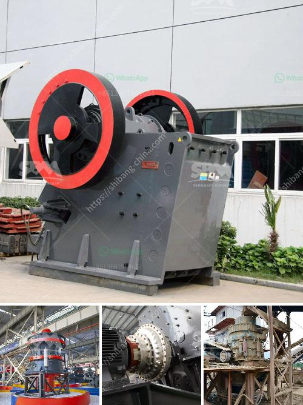

<h3>small used jaw crusher ebay</h3>
In the mining industry, rock crushers are an essential piece of machinery. These devices break up larger rocks into smaller, more manageable sizes, allowing for easier transportation and processing. One popular option for the mining industry is a small used jaw crusher eBay. Available in a wide range of sizes, these crushers are ideal for small-scale mining projects and can also be used in quarries and recycling facilities.

A jaw crusher is a compression-type crusher that uses a fixed jaw and a moving jaw to break rocks by squeezing them between the jaws. It's an efficient and cost-effective solution for crushing hard rock materials. The main components of a jaw crusher include a flywheel, eccentric shaft, toggle plates, pitman, and other parts that are subject to wear and tear.

When shopping for a small used jaw crusher on eBay, it's important to consider various factors like the size of the machine, its condition, and any additional features it may have. Most small used jaw crushers on eBay are listed with a jaw opening of about 2 to 6 inches. However, larger units may have a jaw opening of up to 10 inches.

It's recommended to limit the size of the materials to be crushed to no more than 80% of the jaw opening. This ensures optimal performance and prevents clogging or damage to the crusher. Additionally, the feed size should be consistent and not exceed the specified maximum.

The condition of the crusher is another important aspect to consider. While some used jaw crushers may require minor repairs, others may need more extensive work. It's crucial to carefully inspect the machine and inquire about any recent maintenance or repairs performed. This information will give you an idea of the overall condition of the crusher and help you make an informed purchasing decision.

Depending on the seller, some small used jaw crushers on eBay may come with additional features and accessories. These can include motorized options, adjustable output settings, and even portable or trailer-mounted designs. Take the time to research and compare different listings to find the machine that best suits your specific needs.

When purchasing a small used jaw crusher on eBay, it's essential to consider the total cost, including shipping and any applicable taxes or import duties. Be sure to read the item description and ask the seller any questions you may have regarding payment and shipping options.

In conclusion, a small used jaw crusher eBay is a valuable investment for any mining or quarrying operation. With its ability to break down hard rock materials and its cost-effectiveness, it's a must-have in the industry. Remember to consider factors like size, condition, additional features, and overall cost when shopping for a used jaw crusher on eBay. By doing so, you'll be able to find the perfect machine to tackle your mining or quarrying projects effectively.
<h3>Contact us</h3><ul><li><strong>Whatsapp:&nbsp;<a href="https://wa.me/8613661969651">+8613661969651</a></strong></li><li><a href="https://swt.shibang-china.com/?git&amp;zhl&amp;small used jaw crusher ebay"><strong>Online Service(chat now)</strong></a></li></ul><h3>Related</h3><ul><li><a href='gravel crushers manufacturers.md'>gravel crushers manufacturers</a></li><li><a href='mining of kaolin clay in nigeria.md'>mining of kaolin clay in nigeria</a></li><li><a href='for sale used mobile jaw crusher philippines.md'>for sale used mobile jaw crusher philippines</a></li><li><a href='list of machineries for marble processing plants.md'>list of machineries for marble processing plants</a></li><li><a href='manufacturing process of plaster of paris china.md'>manufacturing process of plaster of paris china</a></li></ul>