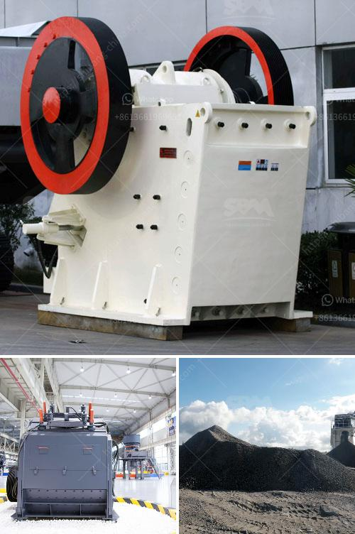

<h3>small used stone crusher machine in india</h3>
Small used stone crusher machine in India refers to the mini jaw crusher machine or the small scale rock crushing plant machines. In general, the small type stone crushing machine has very small size, higher productivity and stable performance. This kind of crusher machine usually needs to cooperate with other systems to realize the whole rock processing production line. Small size, easy transportation, and installation are the main advantages of this crusher machine.

India is abundant with all kinds of mineral resources and a large number of crushers are utilized in India production line. With low cost and high efficiency, India stone crusher machine is widely used in various ore processing lines. In India, the mining industry has been development slowly for a long time. The mining machines’ development is not so fast as well.

Portable mobile stone crusher machine are particularly suitable for crushing materials with particle size of about 50-400mm, thus bringing negative pressure from the high-speed rotating beater head. Therefore, the broken particles are smaller, while the particle size of the finished product is uniform and the quality of the finished product is better.

Small portable stone crusher machine is used in India stone crushing production line with convenient mobile work site. The large output and small size determines that this machine can achieve the higher working efficiency. More and more customers every year buy small scale stone crushing machines due to price. However, some customers do not know how to choose a small scale stone crusher. Here is summarizing two types of small stone crushers that are commonly used in India during different production stages.

Mobile jaw crusher plant as traditional crusher equipment works on the same basic principle as jaw crusher. This means that one machine works as a primary crusher and one machine works as a secondary crusher. It cannot work alone. If feeding size exceeds, the impact rock crusher is used. As secondary crusher, it can crush some mineral ores and rocks, such as granite, basalt, limestone, quartz, iron ore, concrete, etc.

India small used stone crusher machine in India has helped the local clients make high profits and we are looking forward to cooperating with you. Next, I will introduce the specific details of this kind of machine.
<h3>Contact us</h3><ul><li><strong>Whatsapp:&nbsp;<a href="https://wa.me/8613661969651">+8613661969651</a></strong></li><li><a href="https://swt.shibang-china.com/?git&amp;zhl&amp;small used stone crusher machine in india"><strong>Online Service(chat now)</strong></a></li></ul><h3>Related</h3><ul><li><a href='france used conveyor belts for sale.md'>france used conveyor belts for sale</a></li><li><a href='business plan on quarry crusher.md'>business plan on quarry crusher</a></li><li><a href='diffence between vsi and non vsi.md'>diffence between vsi and non vsi</a></li><li><a href='raymond mill technical specification.md'>raymond mill technical specification</a></li><li><a href='diagram of jaw crusher.md'>diagram of jaw crusher</a></li></ul>