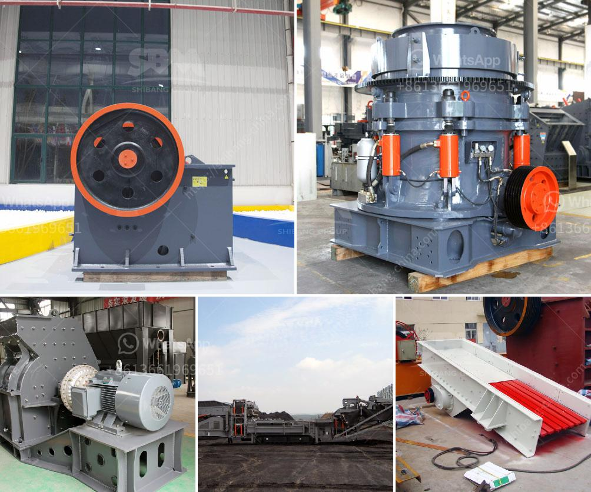

<h3>south africa suppliers of chrome ore beneficiation plant</h3>
South Africa is one of the prominent suppliers of chrome ore globally. The country holds vast reserves of chrome ore, which are extracted through mining processes. Chrome ore beneficiation plants are utilized to transform the particles of extracted ore into a higher grade product suitable for smelting or other industrial processes.

The chrome ore beneficiation plant manufacturers in South Africa are processing the raw material into optimized raw chrome ore that is ideal for smelting. They are developing a range of chrome ore beneficiation plants and equipment, such as crushers, vibrating grizzly feeders, screens, jigs, and spiral separators. These beneficiation plants supply a high-grade chrome concentrate to the end-users, which is further utilized in various industries, including ferrochrome production, stainless steel manufacturing, and chemical production.

South Africa's suppliers of chrome ore beneficiation plants employ advanced technology and sophisticated techniques to increase the quality of chrome ore. For instance, spiral separators are used to separate the ultra-fine material, which is less than 100 microns, to improve the ore grade. Moreover, jigs are used to remove the waste material, ensuring a higher content of chrome ore.

The suppliers of chrome ore beneficiation plants in South Africa have adopted various strategies to meet the increasing demand for chrome ore in the global market. They are investing heavily in R&D activities to develop innovative technologies that enhance the efficiency of the beneficiation process. Furthermore, these companies are focusing on sustainable mining practices to minimize the environmental impact and ensure long-term availability of chrome ore.

In conclusion, South Africa is a leading supplier of chrome ore beneficiation plants, catering to the global market. The country's rich reserves of chrome ore, combined with advanced beneficiation technologies, allow for the production of high-grade chrome concentrate. These suppliers are committed to meeting the increasing demand for chrome ore while adopting sustainable and environmentally friendly practices.
<h3>Contact us</h3><ul><li><strong>Whatsapp:&nbsp;<a href="https://wa.me/8613661969651">+8613661969651</a></strong></li><li><a href="https://swt.shibang-china.com/?git&amp;zhl&amp;south africa suppliers of chrome ore beneficiation plant"><strong>Online Service(chat now)</strong></a></li></ul><h3>Related</h3><ul><li><a href='gypsum calcination processing plant equipments.md'>gypsum calcination processing plant equipments</a></li><li><a href='raymond mill roll asembley.md'>raymond mill roll asembley</a></li><li><a href='stone crusher price in pakistan.md'>stone crusher price in pakistan</a></li><li><a href='stone crusher made in malaysia.md'>stone crusher made in malaysia</a></li><li><a href='small scale tin mining design.md'>small scale tin mining design</a></li></ul>