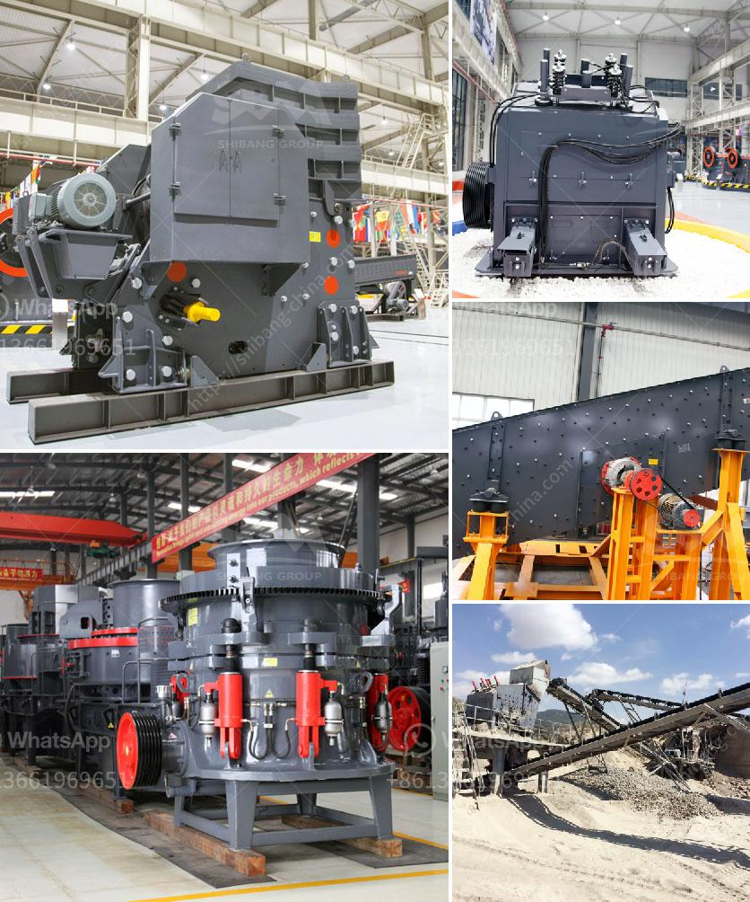

<h3>south korean mobile crusher</h3>
The South Korean mobile crusher is a quality innovation that has made significant strides in recent years. With the introduction of advanced technology and excellent features, the mobile crusher machine has rock-solid performance, making it crucial for construction, mining, and resources industries. To transform stone or any material into usable materials, the mobile crusher efficiently crushes everything it comes across.  

One of the standout features of the South Korean mobile crusher is intelligent control technology. It injects precise control into the crushing process by detecting changes in rock hardness, material thickness, and throughput through advanced sensors. This helps adjust the crusher's settings in real-time, ensuring optimized performance and minimizing downtime. Moreover, the intelligent control technology offers efficiency-enhancing features such as automatic feeding and optimal feeding speed adjustment to produce high-quality aggregate materials.

The mobility factor of this crusher is another significant advantage. With a compact design and easy maneuverability, the South Korean mobile crusher can be transported to various work sites effortlessly. Whether it's on rough terrains, remote locations, or within densely populated areas, this crusher can adapt to any environment. Its ability to be set up quickly makes it ideal for emergency purposes, providing convenience and cost-saving without compromising on quality.

The South Korean mobile crusher also boasts exceptional crushing power and high mobility, allowing it to tackle tough materials. From demolishing reinforced concrete structures to processing natural rocks, this crusher can handle even the most demanding tasks. Its large feeding inlet accepts big-sized materials, while the powerful crushing mechanism efficiently breaks them down. This helps reduce the need for additional crushing equipment, saving time, resources, and money.

Another crucial aspect of the South Korean mobile crusher is its eco-friendly nature. The advancement in engine technology has significantly reduced emissions, making it compliant with stringent environmental regulations. Whether it is low nitrogen oxide (NOx) emissions or eco-friendly noise reduction, this crusher ticks all the boxes for sustainable crushing operations. Additionally, its energy-efficient components lead to reduced energy consumption, providing long-term cost savings and minimizing the carbon footprint.

The South Korean mobile crusher has gained immense popularity in the mining industry. This is due to its ability to enhance productivity while reducing manual labor and maintenance requirements. It has revolutionized the handling of blasted rock and stones by eliminating the need for transportation trucks and reducing the reliance on manual labor. This not only increases job site safety but also boosts project timelines and overall efficiency.

In conclusion, the South Korean mobile crusher is a game-changer in the crushing industry. Its outstanding features, intelligent control technology, exceptional mobility, and eco-friendly nature make it a preferred choice in various industries. By streamlining the crushing process, reducing downtime, and optimizing performance, this crusher machine has brought significant benefits to construction, mining, and resource industries. As the demand for quality aggregate materials continues to rise, the South Korean mobile crusher is set to remain a vital player in the industry for years to come.
<h3>Contact us</h3><ul><li><strong>Whatsapp:&nbsp;<a href="https://wa.me/8613661969651">+8613661969651</a></strong></li><li><a href="https://swt.shibang-china.com/?git&amp;zhl&amp;south korean mobile crusher"><strong>Online Service(chat now)</strong></a></li></ul><h3>Related</h3><ul><li><a href='industrial hammer mill cost.md'>industrial hammer mill cost</a></li><li><a href='suppliers of crusher equipment in south africa.md'>suppliers of crusher equipment in south africa</a></li><li><a href='buy used crushing coal screen plant.md'>buy used crushing coal screen plant</a></li><li><a href='rock crushing machine price in india.md'>rock crushing machine price in india</a></li><li><a href='ton grinding unit cement plant cost.md'>ton grinding unit cement plant cost</a></li></ul>