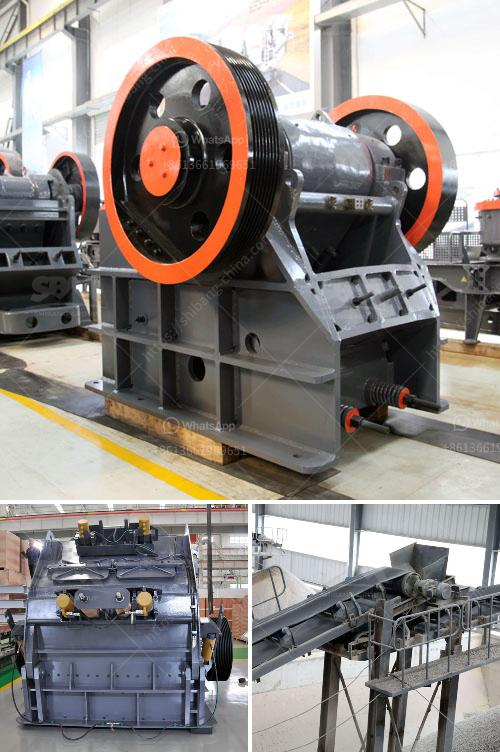

<h3>span of rock crusher equipment</h3>
The span of rock crusher equipment signifies the measure of time during which the equipment is operational, considering various influencing factors. It determines the longevity and efficiency of the machinery used in rock crushing operations. A longer span enables the equipment to function optimally, resulting in increased productivity and reduced downtime.

The durability and reliability of rock crusher equipment play a crucial role in determining its span. High-quality equipment built with robust materials and components tends to have a longer lifespan. Manufacturers that prioritize superior craftsmanship and utilize advanced technologies ensure longer-lasting machines capable of withstanding the harsh conditions of rock crushing.

Regular maintenance and proper care also contribute significantly to extending the span of rock crusher equipment. Routine inspections, lubrication, and timely repairs help prevent potential breakdowns and maximize the operational life of the machinery. Adequate training and knowledge about maintenance procedures among operators can significantly lower the risk of premature failure.

The raw material being processed and its properties have a notable influence on the span of rock crusher equipment. Harder materials, such as granite or basalt, exert more stress on the machinery compared to softer rocks like limestone. This increased stress can lead to accelerated wear and tear, reducing the equipment's lifespan. Selecting appropriate machinery designed for specific rock types and employing suitable wear parts can minimize the impact of harsh materials.

Operational conditions and the environment in which the rock crusher equipment operates affect its span as well. Extremes of temperature, excessive humidity, or dusty conditions can all negatively impact the machinery. Adequate ventilation, climate control, and effective dust suppression systems can help mitigate these issues, extending the lifespan of the equipment.

The capacity and workload of the rock crusher equipment also play a significant role in its span. Machines operating within their designated capacity are less prone to excessive wear and damage. Overloading the equipment can strain its components and lead to premature failure. Regular assessments of workloads and ensuring the machinery is appropriately matched to the application are essential for maximizing its operational lifespan.

Technological advancements in rock crusher equipment have revolutionized the industry, providing greater efficiency and durability. Automation and intelligent control systems optimize operations and minimize human error, resulting in enhanced performance and extended machinery span. Smart monitoring systems can detect potential issues and provide remote diagnostics, enabling proactive maintenance and avoiding unplanned downtime.

In summary, the span of rock crusher equipment is determined by several interconnected factors. The quality and construction of the machinery, regular maintenance, suitability for specific materials, operational conditions, and workload all contribute to the lifespan of the equipment. Investing in high-quality equipment, implementing routine maintenance procedures, and utilizing technological advancements can significantly extend the operational span, ensuring maximum productivity and profitability in rock crushing operations.
<h3>Contact us</h3><ul><li><strong>Whatsapp:&nbsp;<a href="https://wa.me/8613661969651">+8613661969651</a></strong></li><li><a href="https://swt.shibang-china.com/?git&amp;zhl&amp;span of rock crusher equipment"><strong>Online Service(chat now)</strong></a></li></ul><h3>Related</h3><ul><li><a href='low cost jaw crusher price in uganda.md'>low cost jaw crusher price in uganda</a></li><li><a href='total process of gypsum powder plant.md'>total process of gypsum powder plant</a></li><li><a href='toner powder making machine.md'>toner powder making machine</a></li><li><a href='iron ore primarysecondary and tertiary crusher.md'>iron ore primarysecondary and tertiary crusher</a></li><li><a href='canadia crusher portable chassis.md'>canadia crusher portable chassis</a></li></ul>