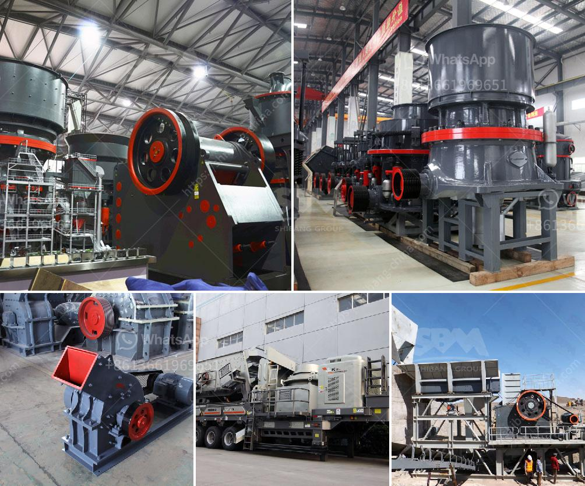

<h3>spec for 200 tph crushing plant</h3>
200 tph crushing and screening plant is a medium-sized, efficient and versatile crushing plant for quarrying, construction and demolition debris, reinforced concrete and asphalt recycling applications. The plant has been designed to provide maximum productivity and efficiency in a wide range of applications and materials.

The 200 tph crushing plant is equipped with a Nordberg® C106™ jaw crusher, which has a proven track record in the toughest of applications. It offers the highest possible fatigue strength, excellent reliability, and numerous mounting possibilities. The plant utilizes a single-toggle jaw crusher, which can handle feed sizes up to 1,000 mm and has a reduction ratio of up to 6:1.

To ensure optimal performance and durability, the 200 tph crushing plant is equipped with a wide range of standard features, including a heavy-duty vibrating grizzly feeder, a large capacity feed hopper, and an advanced automation system. The automation system allows the operator to adjust the settings of the jaw crusher and feeder, monitor the performance of the plant, and control the production rate.

In addition to the jaw crusher, the 200 tph crushing plant also features a 6' x 20' inclined screen module with a double-deck configuration. This allows the plant to produce up to four different sizes of aggregates simultaneously, maximizing the efficiency of the process.

The 200 tph crushing plant is easy to transport and can be quickly set up on any job site. With its compact dimensions and maneuverability, it can crush various materials ranging from hard rock to softer ones for diverse applications. The plant is powered by a reliable and fuel-efficient diesel engine, ensuring low operating costs.

Overall, the 200 tph crushing plant provides a versatile and efficient solution for crushing and screening applications. It is ideal for contractors and quarry operators who require reliable and flexible equipment that can handle various materials and produce high-quality aggregates. With its robust construction and advanced features, the plant offers the perfect balance between performance, durability, and ease of use.
<h3>Contact us</h3><ul><li><strong>Whatsapp:&nbsp;<a href="https://wa.me/8613661969651">+8613661969651</a></strong></li><li><a href="https://swt.shibang-china.com/?git&amp;zhl&amp;spec for 200 tph crushing plant"><strong>Online Service(chat now)</strong></a></li></ul><h3>Related</h3><ul><li><a href='china crushing plant.md'>china crushing plant</a></li><li><a href='used iron ore mining equipment plantand machinery.md'>used iron ore mining equipment plantand machinery</a></li><li><a href='crusher price peru stone.md'>crusher price peru stone</a></li><li><a href='jaw crusher mem fr.md'>jaw crusher mem fr</a></li><li><a href='small portable crusher for laboratory purpose in india.md'>small portable crusher for laboratory purpose in india</a></li></ul>