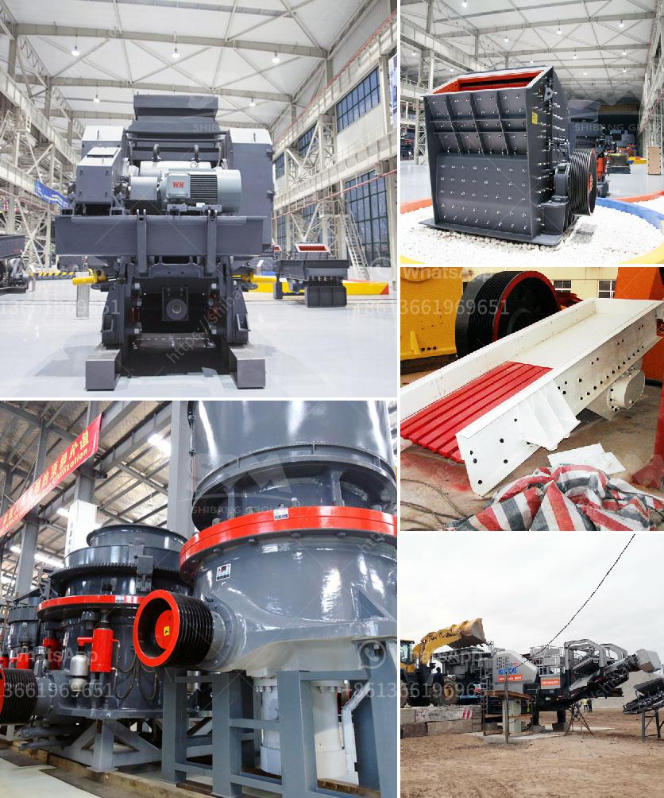

<h3>specification for stone crushing for roads</h3>
Stone crushing plays a key role in the construction of roads around the world, as it helps in achieving the desired strength and durability of the roads. As the roads are subjected to immense pressure due to heavy traffic, it is essential to choose the right type of stone crusher for the road construction to ensure a long-lasting and reliable road network.

When it comes to stone crushing for roads, several factors need to be considered to ensure that the chosen crusher is suitable for the application and will produce the desired results. The following are some important specifications to consider for stone crushing for roads:

1. Aggregate size: The size of the aggregate used to construct the road impacts the strength and stability of the road. Different road construction projects require different aggregate sizes, ranging from small stones to larger boulders. It is important to choose a stone crusher that can produce the required aggregate sizes to meet the specifications of the road project.

2. Crushing efficiency: A good stone crusher should have high crushing efficiency. This ensures that the stones are crushed effectively and uniformly, resulting in a consistent aggregate size. A crusher with a high crushing efficiency will also provide good shape for the aggregates, which is essential for a well-compacted road.

3. Power and capacity: The power and capacity of the stone crusher are other important specifications to consider. They determine the machine's ability to handle the required amount of rocks and produce the desired output. A higher power and capacity ensure that the crusher can effectively process the stones at the required rate, resulting in faster road construction and savings in time and costs.

4. Maintenance and operational costs: Stone crushers require regular maintenance to ensure their proper functioning. It is essential to choose a crusher that is easy to maintain and has low operational costs. This will help in minimizing downtime and reducing the overall lifecycle costs of the road construction project.

5. Environmental impact: Stone crushing can have significant environmental impacts if not done properly. It is important to choose a stone crusher that is equipped with appropriate measures to control dust emissions and noise levels. Additionally, the crusher should have facilities for water spray or dust suppression to minimize the release of harmful particles into the air.

In conclusion, stone crushing plays a crucial role in the construction of roads. Choosing the right stone crusher for the job is essential to ensure the highest level of efficiency and productivity while meeting the specifications of the road project. Considering factors like aggregate size, crushing efficiency, power and capacity, maintenance and operational costs, and environmental impact will help in selecting the most suitable stone crusher for road construction.
<h3>Contact us</h3><ul><li><strong>Whatsapp:&nbsp;<a href="https://wa.me/8613661969651">+8613661969651</a></strong></li><li><a href="https://swt.shibang-china.com/?git&amp;zhl&amp;specification for stone crushing for roads"><strong>Online Service(chat now)</strong></a></li></ul><h3>Related</h3><ul><li><a href='china limestone jaw crusher machine.md'>china limestone jaw crusher machine</a></li><li><a href='sand mining equipment malaysia.md'>sand mining equipment malaysia</a></li><li><a href='raymond mill roll asembley.md'>raymond mill roll asembley</a></li><li><a href='mining equipment cad blocks.md'>mining equipment cad blocks</a></li><li><a href='balance calculations in vertical roller mill.md'>balance calculations in vertical roller mill</a></li></ul>