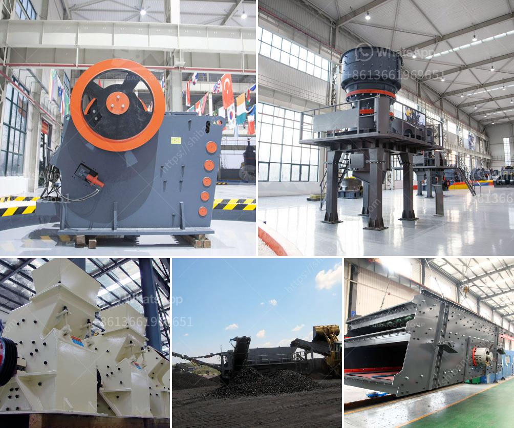

<h3>specifications of a tonnes hour jaw crusher</h3>
A jaw crusher is a useful tool for reducing the size of materials before they are processed further in a crushing circuit. Jaw crushers are robust machines, meaning they have a solid construction. They are used for crushing different types of hard and abrasive materials, such as granite, ores or recycled concrete. Jaw crushers have a high efficiency and uniform product size ratio. They can achieve a crushing ratio of between 4:1 and 6:1.

This means that the jaw crusher can process tonnes of ore per hour, including large rocks, gravel and concrete, into smaller particles. The throughput rate of a jaw crusher is influenced by the feed materials and the discharge settings. The maximum reduction ratio of jaw crushers is 6:1. In terms of the size of the feed opening, the client gets a better return on investment when the primary crusher is a jaw crusher.

That means less drilling and blasting because the crusher accepts larger boulders. The disadvantage of this type of crusher, when high capacity is required, is the relatively small discharge width, limiting the capacity as compared with the discharge circuit of a gyratory crusher. Jaw crushers are mainly used in plants producing up to approximately 1600 t/h.

In terms of the size of the feed opening, the client gets a better return on investment when the primary crusher is a jaw crusher. That means less drilling and blasting because the crusher accepts larger boulders. The disadvantage of this type of crusher, when high capacity is required, is the relatively small discharge width, limiting the capacity as compared with the discharge circuit of a gyratory crusher. Jaw crushers are mainly used in plants producing up to approximately 1600 t/h.

Jaw crushers are characterized by different features such as simple structure, easy maintenance, low cost, reliable operation, and high crushing ratio. They are widely used in mining, smelting, building materials, highways, railways, water conservancy, and chemical industries.

The specifications of a jaw crusher are represented by the width (gape) and depth (narrowest distance between the stationary and moving jaw plates) and the length of the chamber (crusher distance closed-side-setting). Gape width, expressed in inches, can be divided into coarse, medium, and fine, and particles between 6mm and 60mm are common. The size of the product being produced from the jaw crusher can be altered by either manual or hydraulic adjustment.

In conclusion, the jaw crushers are the ideal choice for many applications, provided they are correctly installed and performed to maximize efficiency and productivity. With the appropriate jaw crusher distance setting, the maximum reduction ratio can be achieved, high productivity gained, excellent product shape, and size generated.
<h3>Contact us</h3><ul><li><strong>Whatsapp:&nbsp;<a href="https://wa.me/8613661969651">+8613661969651</a></strong></li><li><a href="https://swt.shibang-china.com/?git&amp;zhl&amp;specifications of a tonnes hour jaw crusher"><strong>Online Service(chat now)</strong></a></li></ul><h3>Related</h3><ul><li><a href='turnkey project for gypsum board manufacturing plant.md'>turnkey project for gypsum board manufacturing plant</a></li><li><a href='limestone needed for 1 ton cement production.md'>limestone needed for 1 ton cement production</a></li><li><a href='functions of a mobile crushing plant.md'>functions of a mobile crushing plant</a></li><li><a href='gypsum processing machine suppliers.md'>gypsum processing machine suppliers</a></li><li><a href='iron ore crusher in pakistan.md'>iron ore crusher in pakistan</a></li></ul>