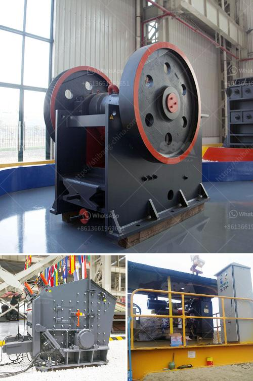

<h3>staalmeester hammer mills</h3>
When it comes to grinding and milling processes, efficiency and quality are of utmost importance. This is where Staalmeester Hammer Mills come in. With their superior design, cutting-edge technology, and robust construction, these hammer mills offer a reliable and efficient solution for grinding a variety of materials.

Staalmeester is a renowned name in the agricultural sector, known for its innovation and dedication to delivering high-quality equipment. Their hammer mills are a testament to their commitment to excellence. Crafted with precision and attention to detail, these mills are built to withstand the demands of heavy-duty grinding and milling applications.

One of the key features that set Staalmeester Hammer Mills apart from the competition is their cutting-edge design. These mills are equipped with strong and durable grinding blades that are perfectly balanced, ensuring consistent and efficient grinding. This design also helps reduce the risk of overheating, resulting in improved productivity and longer equipment lifespan.

Another notable feature of Staalmeester Hammer Mills is their versatility. These mills are designed to handle a wide range of materials, including grains, grasses, herbs, and other organic materials. Whether you need to grind maize for livestock feed or herbs for herbal medicines, these mills can deliver the desired results with precision and efficiency.

Staalmeester Hammer Mills are also exceptionally user-friendly. The mills are equipped with a user-friendly control panel that allows for easy adjustments of grinding settings, ensuring optimal results for every material. Additionally, these mills are designed with safety in mind, featuring various safety measures to protect the operator and minimize the risk of accidents.

In terms of construction, Staalmeester Hammer Mills are built to last. The mills are made from high-quality materials and undergo rigorous testing to ensure durability and reliability. The robust construction and superior craftsmanship ensure that these mills can withstand heavy-duty use in demanding agricultural environments.

Moreover, Staalmeester understands the importance of after-sales support. They offer comprehensive customer service, including technical support and spare parts availability. This commitment to customer satisfaction ensures that your investment in a Staalmeester Hammer Mill is protected for years to come.

In conclusion, Staalmeester Hammer Mills provide an ideal solution for grinding and milling a wide range of materials. With their superior design, cutting-edge technology, and robust construction, these mills offer efficiency, durability, and versatility. Whether you are a farmer, a feed mill operator, or involved in any milling operation, Staalmeester Hammer Mills are an essential addition to your equipment arsenal. Invest in Staalmeester Hammer Mills and experience unmatched grinding and milling efficiency.
<h3>Contact us</h3><ul><li><strong>Whatsapp:&nbsp;<a href="https://wa.me/8613661969651">+8613661969651</a></strong></li><li><a href="https://swt.shibang-china.com/?git&amp;zhl&amp;staalmeester hammer mills"><strong>Online Service(chat now)</strong></a></li></ul><h3>Related</h3><ul><li><a href='vertical roller mills manufacturer in india.md'>vertical roller mills manufacturer in india</a></li><li><a href='100 tph stone crusher diesel consumption.md'>100 tph stone crusher diesel consumption</a></li><li><a href='coal beneficiation.md'>coal beneficiation</a></li><li><a href='dubai dolomite crusher suppliers.md'>dubai dolomite crusher suppliers</a></li><li><a href='cement plant production line.md'>cement plant production line</a></li></ul>