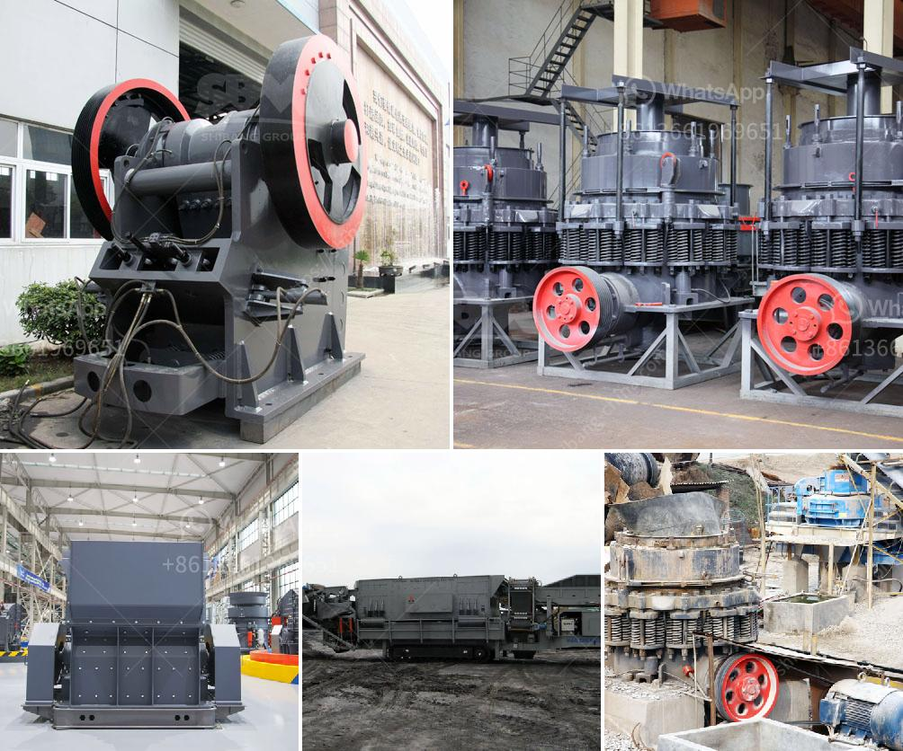

<h3>standard operating procedure for cement manufacturing</h3>
Cement manufacturing is a highly regulated industry that requires utmost precision and accuracy in its processes to deliver a consistently high-quality product. To ensure efficiency and safety, cement plants follow a stringent standard operating procedure (SOP) that encompasses various steps and guidelines. Here is an overview of the typical SOP for cement manufacturing.

1. Quarrying: The raw materials, mainly limestone and clay, are obtained from quarries. The first step of the SOP involves extracting these materials using heavy machinery like excavators and loaders, while ensuring proper safety measures are followed.

2. Crushing and Grinding: Once the raw materials are obtained, they are crushed into smaller pieces using crushers. The crushed materials are then further ground into fine powder in a rotating ball mill. This process helps in creating a homogenous mix for the kiln.

3. Pre-heating and Pre-calcination: The fine powder from the grinding process is heated in a pre-heater tower to remove any moisture and prepare it for the kiln. Pre-calcination takes place, wherein the material is partially calcined before entering the main kiln.

4. Clinker Production: The pre-heated and pre-calcined raw material is fed into the kiln, where it is subjected to high heat to produce clinker. The clinker is a marbly material that goes through a series of chemical reactions to develop high strength binding properties.

5. Grinding Clinker with Gypsum: The clinker is then cooled and ground into a fine powder with the addition of a small amount of gypsum. This step gives the cement its final desired properties, such as setting time and strength.

6. Quality Control: Throughout the manufacturing process, cement plants conduct rigorous quality control checks to ensure that the product meets the required specifications. These checks include testing the cement for strength, setting time, chemical composition, and other parameters.

7. Packaging and Distribution: The final step of the SOP includes packing the cement in bags or bulk containers for distribution. Suitable packaging and labeling are done to ensure proper identification and safe transportation.

It is crucial for cement plants to strictly adhere to this standard operating procedure to maintain consistency in the quality of cement produced. Maintaining a clean and safe working environment, regular equipment maintenance, and adhering to environmental regulations are also essential aspects of the SOP. By following these guidelines, cement manufacturers can ensure the production of a reliable and high-performance product for various construction applications.
<h3>Contact us</h3><ul><li><strong>Whatsapp:&nbsp;<a href="https://wa.me/8613661969651">+8613661969651</a></strong></li><li><a href="https://swt.shibang-china.com/?git&amp;zhl&amp;standard operating procedure for cement manufacturing"><strong>Online Service(chat now)</strong></a></li></ul><h3>Related</h3><ul><li><a href='marcasite ball mill.md'>marcasite ball mill</a></li><li><a href='aggregate grinding mill manufacturers in south philippines.md'>aggregate grinding mill manufacturers in south philippines</a></li><li><a href='gold ore milling machine.md'>gold ore milling machine</a></li><li><a href='crushing plant limestone.md'>crushing plant limestone</a></li><li><a href='jaw crusher sale.md'>jaw crusher sale</a></li></ul>