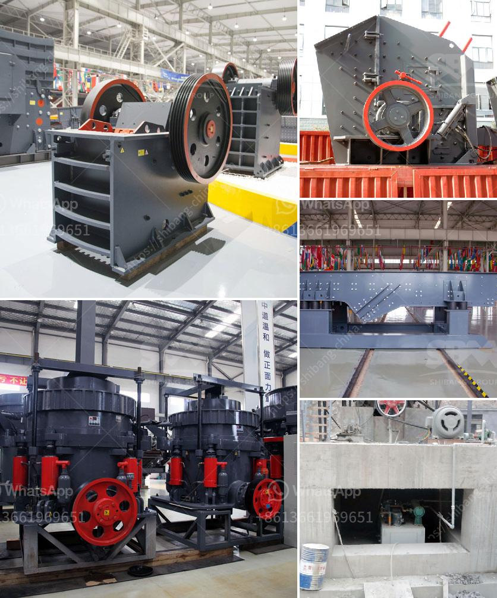

<h3>start up granite quarry crusher business</h3>
Starting a granite quarry crusher business can be a lucrative venture if you have the right resources and mindset. The industry is booming with the increasing demand for granite in construction projects. But starting a crusher business requires hefty investment, strict licensing procedures, and a strong business plan. This article will outline the key steps to take when starting a granite quarry crusher business.

Firstly, you need to identify a suitable location for the quarry. A granite quarry typically requires a large expanse of land for excavation. Look for areas rich in granite deposits and ensure that the land has proper access routes for transportation of the mined materials. Conduct feasibility studies to determine if the area has enough demand for granite products and if you can compete with existing players.

Once you have identified the location, you need to obtain the necessary licenses and permits. Contact local authorities to understand the specific requirements for operating a quarry crusher business in your area. This may include obtaining mining rights, environmental clearances, and health and safety permits. Compliance with regulations is crucial to avoid legal issues and penalties that could potentially shut down your operation.

Next, you need to secure funding for your business. Starting a granite quarry crusher business requires significant investment, as you will need heavy machinery, vehicles, and a team of skilled workers. Approach banks, financial institutions, or private investors to secure a loan or find potential partners who are willing to invest in your venture. A well-prepared business plan will significantly increase your chances of attracting financial support.

After securing funding, you can now acquire the necessary equipment and machinery for your quarry. This includes crushers, excavators, loaders, and trucks for transportation. It is important to choose high-quality equipment that is durable and cost-effective in the long run. Consider factors such as production capacity, power consumption, and maintenance requirements when purchasing your equipment.

Once your quarry is operational, focus on marketing and building a strong customer base. Identify potential buyers such as construction companies, contractors, and government agencies. Build relationships with these stakeholders by showcasing the quality of your granite products and offering competitive prices. Leveraging online platforms and social media can also help increase your visibility and attract more customers.

Regularly assess and improve your operations to ensure profitability and customer satisfaction. Monitor your production efficiency, manage your inventory effectively, and streamline your logistics. Regularly maintain and repair your equipment to avoid downtime, as this can significantly impact your revenue.

In conclusion, starting a granite quarry crusher business can be a profitable venture with careful planning and execution. Ensure that you have a solid business plan, secure the necessary licenses and permits, and acquire high-quality equipment. Build relationships with potential buyers and continuously improve your operations to succeed in this industry.
<h3>Contact us</h3><ul><li><strong>Whatsapp:&nbsp;<a href="https://wa.me/8613661969651">+8613661969651</a></strong></li><li><a href="https://swt.shibang-china.com/?git&amp;zhl&amp;start up granite quarry crusher business"><strong>Online Service(chat now)</strong></a></li></ul><h3>Related</h3><ul><li><a href='used lab scale crusher price.md'>used lab scale crusher price</a></li><li><a href='gold milling plant on small scale.md'>gold milling plant on small scale</a></li><li><a href='ore crushers benoni.md'>ore crushers benoni</a></li><li><a href='ball mill price list.md'>ball mill price list</a></li><li><a href='barite grinding plants.md'>barite grinding plants</a></li></ul>