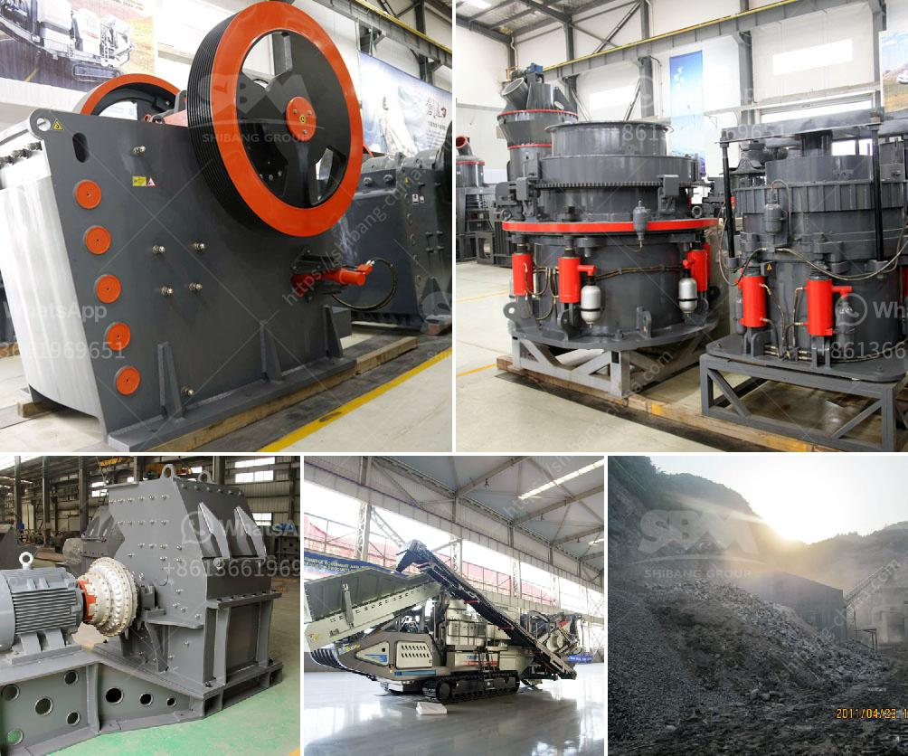

<h3>stasioner stone crusher</h3>
The importance of stationary stone crushers for mining operations cannot be underestimated. These heavy-duty machines are designed to reduce the size of large rocks and stones, making them easier to transport and crush. The practicality and low maintenance requirements make it a popular choice for mining operations of all sizes.

The primary purpose of a stationary stone crusher is to break down large rock into smaller pieces. The machine works by using a powerful jaw that crushes the rocks into pieces of various sizes. This process is achieved through the use of different-sized screens, which allow the stones to be sorted based on their size before they can be further processed.

Stationary stone crushers offer a number of benefits for mining operations. For instance, the ability to move within heavy mining equipment allows the equipment to be transported to different areas for work. This flexibility makes it possible for operators to quickly and efficiently move their equipment to where it is needed most, saving both time and money.

Another advantage of using a stationary stone crusher is the low cost per ton of crushed material. With a well-designed machine, operators can process more material in a shorter amount of time, reducing operating costs significantly. Additionally, these crushers require minimal maintenance, resulting in even lower operating costs.

Stationary stone crushers also offer environmental benefits. By reducing the size of rocks and stones, the amount of material that needs to be extracted is reduced. This means fewer trucks and less transportation, resulting in reduced emissions and a smaller carbon footprint. Furthermore, the stationary nature of these crushers reduces the need for auxiliary equipment, such as screens and conveyors, which further minimizes the environmental impact.

Another advantage of stationary stone crushers is their durability and long lifespan. These machines are built to withstand the harshest conditions and can endure continuous operation for years without significant wear or damage. This means that operators can rely on their equipment to provide consistent and reliable performance without the need for frequent repairs or replacements.

Investing in a stationary stone crusher is a wise and cost-effective decision for any mining operation. With their ability to withstand harsh conditions, low maintenance requirements, and environmental benefits, these machines provide a reliable and efficient solution for crushing large rocks and stones. Furthermore, the low cost per ton of crushed material and the ability to easily transport the equipment to different areas make it a versatile and valuable asset for any mining operation.

In conclusion, stationary stone crushers offer numerous advantages for mining operations. From reducing the size of large rocks to providing a low cost per ton of crushed material, these machines are a valuable investment for any mining company. Their durability, environmental benefits, and low maintenance requirements make them an ideal choice for long-term use in mining operations. Investing in a stationary stone crusher is a wise decision that can provide a powerful and efficient solution for crushing large rocks and stones.
<h3>Contact us</h3><ul><li><strong>Whatsapp:&nbsp;<a href="https://wa.me/8613661969651">+8613661969651</a></strong></li><li><a href="https://swt.shibang-china.com/?git&amp;zhl&amp;stasioner stone crusher"><strong>Online Service(chat now)</strong></a></li></ul><h3>Related</h3><ul><li><a href='stone crusher sand block maker.md'>stone crusher sand block maker</a></li><li><a href='rock quarry equipment for sale.md'>rock quarry equipment for sale</a></li><li><a href='dry mix mortar plant from turkey.md'>dry mix mortar plant from turkey</a></li><li><a href='coal washing plant supplier south africa.md'>coal washing plant supplier south africa</a></li><li><a href='mobile stone crusher in germany.md'>mobile stone crusher in germany</a></li></ul>