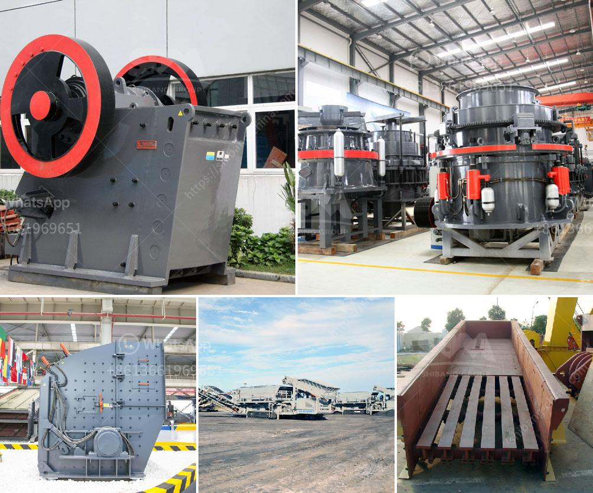

<h3>station mobile de lavage de diamants</h3>
In the bustling world of diamond mining and manufacturing, maintaining the brilliance and allure of these precious gems is of utmost importance. Diamond cleaning, an essential step in the diamond production process, ensures that every diamond is showcased in its finest light. With the advancement of technology, the introduction of a groundbreaking solution – the Station Mobile de Lavage de Diamants, or Mobile Diamond Washing Station – has taken the industry by storm.

The Mobile Diamond Washing Station offers a portable and efficient way to clean diamonds. It is equipped with state-of-the-art technology that uses a combination of water jets and ultrasound vibrations to remove dirt, oil, and other contaminants from the surface of the diamonds. This innovative solution not only enhances the overall appearance of the diamonds but also improves their value and marketability.

One of the key advantages of the Mobile Diamond Washing Station is its mobility. Traditional diamond cleaning methods often require transporting the diamonds to a fixed cleaning facility, which can be time-consuming and risky. With the Mobile Diamond Washing Station, diamond producers and manufacturers can now bring the cleaning process directly to the diamonds, reducing the chances of damage or loss during transportation. This mobility factor also enables on-site cleaning, eliminating the need for outsourcing and reducing production time and costs.

Furthermore, the Station Mobile de Lavage de Diamants is designed to ensure maximum safety and minimal environmental impact. The system is equipped with advanced filtration mechanisms that capture and recycle the cleaning solution, minimizing water waste and chemical contamination. This eco-friendly feature aligns with the industry's growing emphasis on sustainable practices, making the Mobile Diamond Washing Station an ideal choice for environmentally conscious diamond producers.

In conclusion, the Station Mobile de Lavage de Diamants has revolutionized the diamond cleaning process, offering the diamond industry a portable, efficient, and sustainable solution. Its innovative technology, combined with its mobility and environmental consciousness, has made it an invaluable asset for diamond producers and manufacturers worldwide. With the Mobile Diamond Washing Station, diamonds can now sparkle with their full brilliance, captivating those who lay eyes on them.
<h3>Contact us</h3><ul><li><strong>Whatsapp:&nbsp;<a href="https://wa.me/8613661969651">+8613661969651</a></strong></li><li><a href="https://swt.shibang-china.com/?git&amp;zhl&amp;station mobile de lavage de diamants"><strong>Online Service(chat now)</strong></a></li></ul><h3>Related</h3><ul><li><a href='ball mills south africa.md'>ball mills south africa</a></li><li><a href='price list stone crusher machine sri lanka.md'>price list stone crusher machine sri lanka</a></li><li><a href='rubber grinder machine in philippines.md'>rubber grinder machine in philippines</a></li><li><a href='stone crusher price in pakistan.md'>stone crusher price in pakistan</a></li><li><a href='calculation of torque of hammer mill.md'>calculation of torque of hammer mill</a></li></ul>