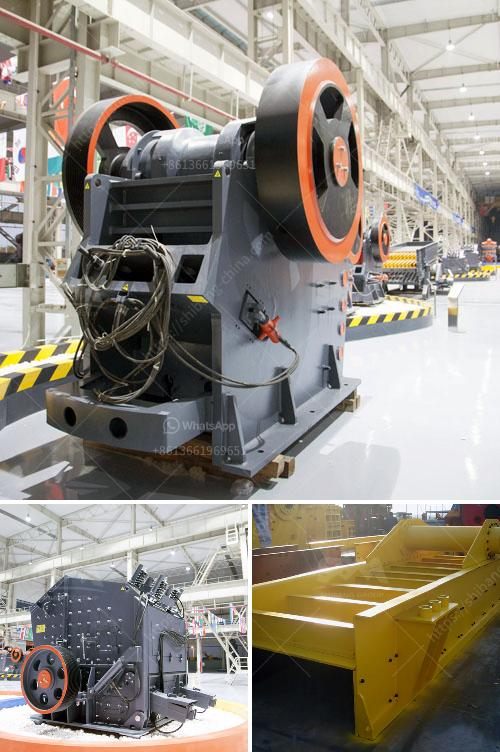

<h3>stationary crushers and screens</h3>
Stationary crushers and screens are essential equipment in the mining and aggregate industries. They are used to crush rocks and stones into smaller sizes or to separate different materials based on their sizes and shapes. These machines play a crucial role in improving the efficiency and productivity of mining and construction operations.

One of the main advantages of stationary crushers and screens is their stability and durability. Unlike mobile crushers, which need to be constantly moved from one site to another, stationary machines are permanently installed at a specific location. This allows them to handle high volumes of material without the need for frequent relocation, resulting in reduced downtime and increased production.

Stationary crushers and screens are available in a wide range of models and sizes to suit different requirements. They can be designed for primary, secondary, or tertiary crushing, depending on the application. Some crushers are specifically built for hard rock mining, while others are more suitable for processing softer materials like limestone or recycled concrete.

Screens, on the other hand, are used to separate materials based on their sizes. They come in various configurations, including inclined, horizontal, or banana screen designs, allowing for efficient material classification. Screens are often used in conjunction with crushers to maximize production and ensure the desired product sizes.

In addition to their stability and versatility, stationary crushers and screens also offer better control over the final product quality. With precise settings and adjustments, operators can achieve the desired size distribution and shape of the crushed materials. This is crucial for meeting specific market demands and ensuring the optimal performance of downstream processes, such as concrete production or asphalt mixing.

Overall, stationary crushers and screens are essential equipment for the mining and aggregate industries. They provide stable, durable, and efficient solutions for crushing and screening applications, contributing to increased productivity, reduced downtime, and improved product quality. Companies in these industries must carefully choose the right equipment to match their specific needs and maximize their overall operations.
<h3>Contact us</h3><ul><li><strong>Whatsapp:&nbsp;<a href="https://wa.me/8613661969651">+8613661969651</a></strong></li><li><a href="https://swt.shibang-china.com/?git&amp;zhl&amp;stationary crushers and screens"><strong>Online Service(chat now)</strong></a></li></ul><h3>Related</h3><ul><li><a href='ball mill machine in pakistan.md'>ball mill machine in pakistan</a></li><li><a href='crusher supplier pakistan.md'>crusher supplier pakistan</a></li><li><a href='calculation of torque of hammer mill.md'>calculation of torque of hammer mill</a></li><li><a href='mineral pulverizer to 300 micron.md'>mineral pulverizer to 300 micron</a></li><li><a href='ball mills manufacturers in india.md'>ball mills manufacturers in india</a></li></ul>