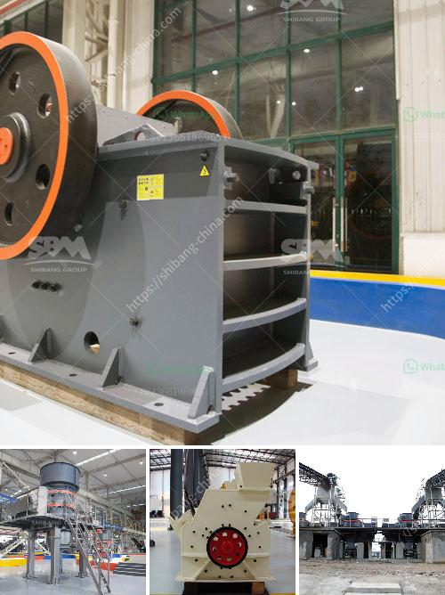

<h3>steel slag recycling plant</h3>
Steel slag is a byproduct of the steelmaking process, and its disposal has been a long-standing environmental concern. However, the development of steel slag recycling plants has provided a sustainable solution to this problem. These plants have the capacity to process and recycle hundreds of thousands of tons of steel slag annually.

One such plant is the steel slag recycling plant owned by a prominent steel company. It is located in a strategic location, near the steel production plant and the highway, which enables easy transportation of the steel slag. The plant has a comprehensive system for receiving, processing, and recycling the slag.

The first step in the recycling process is the crushing and screening of the slag to obtain smaller-sized fractions. This is followed by the separation of iron from the non-ferrous minerals present in the slag. Magnetic separators are used to efficiently separate the iron, which can be further processed and used as a raw material in steel production.

The non-ferrous minerals, on the other hand, are processed through various techniques to obtain different products. These include aggregates for construction purposes, which can substitute traditional materials, thus reducing the environmental impact of construction activities. The plant also produces slag cement, which can be used in infrastructure projects, providing a sustainable alternative to traditional Portland cement.

In addition to the environmental benefits, the establishment of steel slag recycling plants also has economic advantages. It creates job opportunities for the local community and contributes to the overall development of the region. Moreover, the recycled products can be sold in the market, generating revenue for the steel company.

Overall, the steel slag recycling plant is a prime example of sustainable industrial practices. It not only addresses the environmental concerns associated with steel slag disposal but also harnesses the potential of this byproduct. With the capacity to process hundreds of thousands of tons of slag, these plants are a crucial step towards a more sustainable steel industry.
<h3>Contact us</h3><ul><li><strong>Whatsapp:&nbsp;<a href="https://wa.me/8613661969651">+8613661969651</a></strong></li><li><a href="https://swt.shibang-china.com/?git&amp;zhl&amp;steel slag recycling plant"><strong>Online Service(chat now)</strong></a></li></ul><h3>Related</h3><ul><li><a href='50 tph raymond mills.md'>50 tph raymond mills</a></li><li><a href='china limestone jaw crusher machine.md'>china limestone jaw crusher machine</a></li><li><a href='list of machineries for marble processing plants.md'>list of machineries for marble processing plants</a></li><li><a href='black granite land for sale in tamilnadu.md'>black granite land for sale in tamilnadu</a></li><li><a href='power draw calculator of ball mill.md'>power draw calculator of ball mill</a></li></ul>