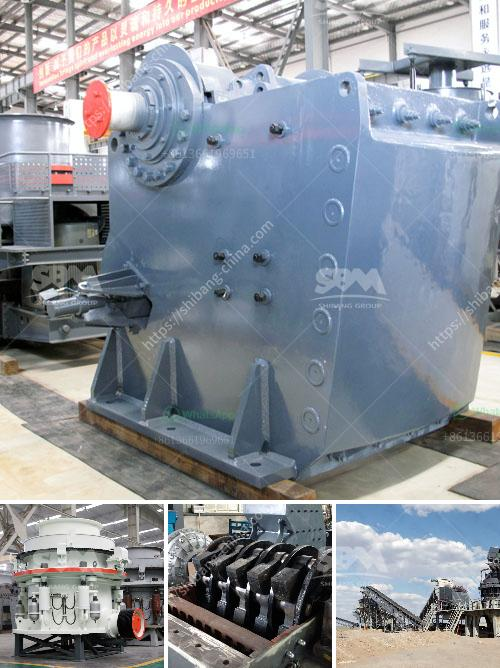

<h3>stone ball mill up mesh</h3>
Stone ball mill is a basic device in the ore beneficiation process. Its efficiency and working principle are highly praised by users. In this article, we will introduce the stone ball mill up mesh.

The stone ball mill is a horizontal rotating device driven by an external gear. The material is evenly fed into the grinding chamber through the hollow shaft, and then crushed and ground by the grinding media (steel balls) inside. The finished material is discharged from the outlet, and the grinding process is completed.

One of the important features of the stone ball mill is its ability to grind materials to a specific fineness. The mesh size refers to the number of holes per square inch of the screen. The higher the mesh number, the finer the grinding. For example, a mesh size of 300 means that there are 300 holes per square inch of the screen. The material passing through this screen will have a fineness of approximately 50 microns.

The stone ball mill is usually equipped with a classifier to control the particle size of the finished product. The classifier separates the coarse particles from the fine particles through the centrifugal force generated by the rotating airflow. The coarse particles are returned to the grinding chamber for regrinding, while the fine particles are collected and discharged separately.

The choice of the mesh size depends on the nature of the material and the requirements of the process. For example, in the beneficiation of iron ore, a finer mesh size is required to liberate the valuable minerals from the gangue. On the other hand, in the grinding of cement clinker, a coarser mesh size may be sufficient.

It is worth noting that the stone ball mill up mesh size is not the only factor affecting the grinding efficiency. The nature of the material, the size of the grinding media, the rotation speed of the mill, and the filling rate of the grinding media also play important roles. Therefore, it is necessary to optimize these parameters to achieve the desired grinding effect.

In conclusion, the stone ball mill up mesh is an important process in the ore beneficiation. The mesh size determines the fineness of the grinding, and it can be adjusted according to the specific requirements. The stone ball mill, along with other factors, plays a vital role in the grinding process, ensuring the efficient recovery of valuable minerals.
<h3>Contact us</h3><ul><li><strong>Whatsapp:&nbsp;<a href="https://wa.me/8613661969651">+8613661969651</a></strong></li><li><a href="https://swt.shibang-china.com/?git&amp;zhl&amp;stone ball mill up mesh"><strong>Online Service(chat now)</strong></a></li></ul><h3>Related</h3><ul><li><a href='mining process of dolomite ryamond mill in kenya.md'>mining process of dolomite ryamond mill in kenya</a></li><li><a href='ball mills brands.md'>ball mills brands</a></li><li><a href='marble powder plant price pakistan.md'>marble powder plant price pakistan</a></li><li><a href='granite aggregate quarry machinary for sale.md'>granite aggregate quarry machinary for sale</a></li><li><a href='thailand coconut processing machine.md'>thailand coconut processing machine</a></li></ul>